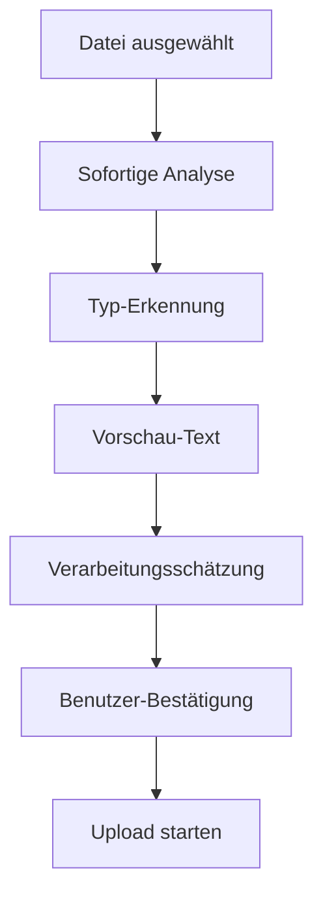
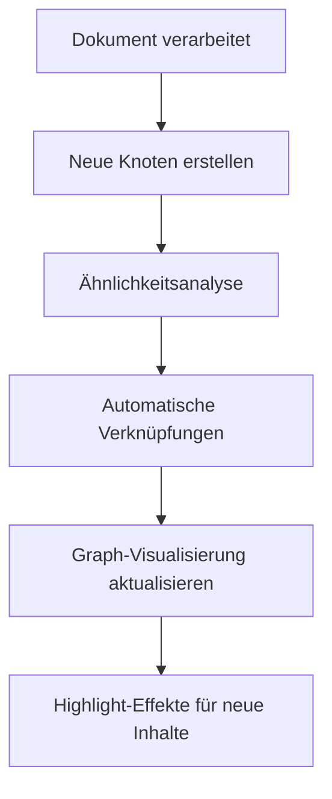
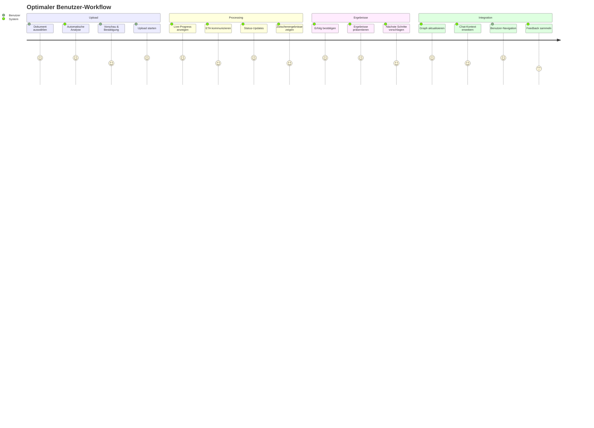

# 🚀 Optimaler Dokument-Workflow - Implementierungsplan

**Datum:** 27. Januar 2025  
**Status:** In Entwicklung  
**Ziel:** Vollständige Transparenz des Dokument-Verarbeitungsprozesses

---

## 🎯 **PROBLEM & LÖSUNG**

### **Aktueller Zustand:**
- ✅ Upload funktioniert (grüner Haken)
- ❌ **"Blackbox-Effekt"** - Benutzer sieht nicht, was passiert
- ❌ Keine Transparenz über Verarbeitungsschritte
- ❌ Keine Visualisierung der Ergebnisse
- ❌ Keine Integration mit Graph/Chat

### **Gewünschter Zustand:**
- ✅ **Vollständige Transparenz** aller Verarbeitungsschritte
- ✅ **Echtzeit-Progress** mit Live-Updates
- ✅ **Intelligente Vorhersagen** über Verarbeitungsdauer
- ✅ **Direkte Integration** in Graph und Chat
- ✅ **Benutzerfreundliche Visualisierung** der Ergebnisse

---

## 📋 **IMPLEMENTIERUNGSPHASEN**

### **🔥 PHASE 1: Upload-Transparenz (SOFORT - 4-6 Stunden)**

#### **1.1 Pre-Upload Analyse** ⏱️ *1-2 Stunden*
**Ziel:** Dokument analysieren BEVOR Upload startet

**Was passiert:**


**Technische Umsetzung:**
- **Endpoint:** `POST /documents/analyze-preview`
- **Frontend:** Automatische Analyse nach Datei-Auswahl
- **Anzeige:** Dokument-Typ, Vorschau, Schätzungen
- **Benutzer-Entscheidung:** "Upload starten" oder "Abbrechen"

**Beispiel-Anzeige:**
```
📄 dokument.pdf (2.3 MB)
🎯 Erkannt als: BSI IT-Grundschutz
📝 Vorschau: "Das IT-Grundschutz-Kompendium des BSI..."
⏱️ Geschätzte Dauer: ~3 Minuten
📊 Erwartete Ergebnisse: ~45 Controls, ~12 Chunks
✅ Upload starten
```

#### **1.2 Echtzeit Progress-Tracking** ⏱️ *2-3 Stunden*
**Ziel:** Live-Fortschritt während der Verarbeitung

**Progress-Stufen:**
```
📤 Upload (0-30%): Datei-Transfer
🔍 Analyse (30-50%): Content-Extraktion
🎯 Klassifizierung (50-70%): Dokument-Typ bestätigen
⚡ Extraktion (70-90%): Controls/Chunks erstellen
✅ Finalisierung (90-100%): Graph/Vector-Storage
```

**Technische Umsetzung:**
- **Endpoint:** `GET /documents/processing-status/{task_id}`
- **Polling:** Alle 2 Sekunden Status abrufen
- **WebSocket:** Für echte Echtzeit-Updates (später)
- **Timeout:** Nach 5 Minuten Fehlermeldung

**Beispiel-Anzeige:**
```
⚡ Verarbeitung läuft... 73%
🎯 Aktueller Schritt: Control-Extraktion
📊 Fortschritt: [████████████████░░░░] 73%
🕐 ETA: Noch ~2 Minuten
✅ Abgeschlossen: Upload, Typ-Erkennung, Klassifizierung
```

#### **1.3 Detaillierte Ergebnisse** ⏱️ *1 Stunde*
**Ziel:** Klare Visualisierung der Verarbeitungsergebnisse

**Ergebnis-Komponenten:**
- **Bestätigter Dokument-Typ**
- **Extrahierte Controls** (Anzahl + Beispiele)
- **Erstellte Chunks** (Anzahl + Vorschau)
- **Direkte Aktionen** (Graph, Chat, Details)

**Beispiel-Anzeige:**
```
🎉 Verarbeitung erfolgreich abgeschlossen!

📄 bsi-grundschutz-2024.pdf
🎯 Typ: BSI IT-Grundschutz (bestätigt)
📊 Ergebnisse:
   🔒 23 Controls extrahiert
   📝 12 Wissens-Chunks erstellt
   🕸️ 47 neue Graph-Verbindungen

🚀 Nächste Schritte:
   [🕸️ Im Graph ansehen] [💬 Chat starten] [📄 Details]
```

---

### **📊 PHASE 2: Nach-Upload Visualisierung (TAG 2)**

#### **2.1 Processing-Dashboard**
**Ziel:** Umfassende Übersicht über alle Verarbeitungsschritte

**Dashboard-Komponenten:**
- **Live-Timeline** aller Verarbeitungsschritte
- **Fortschritts-Visualisierung** mit Animations
- **Technische Details** für interessierte Benutzer
- **Fehler-Behandlung** mit Retry-Optionen

#### **2.2 Ergebnis-Integration**
**Ziel:** Nahtlose Integration der Ergebnisse in bestehende UI

**Integration-Punkte:**
- **Graph-View:** Neue Knoten hervorheben
- **Chat-Interface:** Dokument-Kontext automatisch verfügbar
- **Upload-Historie:** Alle verarbeiteten Dokumente auflisten
- **Search:** Neue Inhalte sofort durchsuchbar

---

### **🕸️ PHASE 3: Graph-Integration (TAG 3-4)**

#### **3.1 Automatische Graph-Aktualisierung**
**Ziel:** Neue Inhalte sofort im Knowledge Graph sichtbar

**Graph-Updates:**


**Technische Umsetzung:**
- **Real-time Graph Updates** via WebSocket
- **Intelligent Clustering** ähnlicher Inhalte
- **Visual Highlights** für neue Knoten (24h)
- **Animated Transitions** für neue Verbindungen

#### **3.2 Intelligente Verknüpfung**
**Ziel:** Automatische Erkennung von Beziehungen zwischen Dokumenten

**Verknüpfungs-Strategien:**
- **Ähnliche Controls:** BSI-A.1 ↔ ISO-A.1
- **Gleiche Technologien:** Azure ↔ Cloud Security
- **Verwandte Begriffe:** Encryption ↔ Verschlüsselung
- **Hierarchische Beziehungen:** Kapitel ↔ Unterkapitel

---

### **💬 PHASE 4: Chat-Integration (TAG 5)**

#### **4.1 Dokument-spezifischer Chat**
**Ziel:** Intelligente Unterhaltungen über neue Dokumente

**Chat-Erweiterungen:**
- **Automatischer Kontext:** "Sie haben gerade X hochgeladen"
- **Proaktive Vorschläge:** "Hier sind 3 wichtige Fragen zu Ihrem Dokument"
- **Referenz-Fähigkeit:** Direkte Zitate aus dem neuen Dokument
- **Cross-Referencing:** Vergleiche mit bestehenden Dokumenten

**Beispiel-Chat-Flow:**
```
🤖 Ich habe Ihr BSI IT-Grundschutz Dokument analysiert! 
   23 Controls gefunden. Hier sind einige Fragen, die ich beantworten kann:

   📋 "Welche Controls sind am kritischsten?"
   🔍 "Wie hängt das mit unseren ISO-Dokumenten zusammen?"
   ⚡ "Welche Technologien werden für die Umsetzung empfohlen?"

👤 Welche Controls sind am kritischsten?

🤖 Basierend auf Ihrem Dokument sind diese 5 Controls besonders kritisch:
   1. A.12.1.1 - Backup-Verfahren (Risiko: HOCH)
   2. A.9.1.2 - Zugriffskontrolle (Risiko: HOCH)
   ...
```

#### **4.2 Proaktive Vorschläge**
**Ziel:** System schlägt relevante Aktionen vor

**Intelligente Vorschläge:**
- **Fehlende Dokumente:** "Ihnen fehlt noch ISO 27001 für vollständige Compliance"
- **Verbesserungsmöglichkeiten:** "Control A.1.1 könnte durch Dokument X ergänzt werden"
- **Automatisierung:** "Diese 5 Controls können automatisch überwacht werden"

---

### **🎮 PHASE 5: Benutzer-Journey Optimierung (TAG 6-7)**

#### **5.1 Guided Workflow**
**Ziel:** Benutzer durch den optimalen Workflow führen

**Workflow-Schritte:**


#### **5.2 Onboarding-Tour**
**Ziel:** Neue Benutzer optimal einführen

**Tour-Stops:**
```
👋 "Willkommen! Lassen Sie mich Ihnen zeigen, was mit Ihrem Dokument passiert ist..."

🎯 Stop 1: "Ihr Dokument wurde als BSI IT-Grundschutz erkannt"
📊 Stop 2: "Wir haben 23 Controls und 8 Chunks extrahiert"
🕸️ Stop 3: "Hier sehen Sie die neuen Verbindungen im Graph"
💬 Stop 4: "Stellen Sie jetzt Fragen zu Ihrem Dokument"
🔄 Stop 5: "Der Workflow läuft automatisch bei jedem Upload"
```

---

## ⚡ **SOFORT-IMPLEMENTIERUNG**

### **Schritt 1: Backend-Endpunkte erweitern** ✅ *ERLEDIGT*
- ✅ Processing-Status Endpunkt verbessert
- ⏳ Analyze-Preview Endpunkt (funktioniert bereits)
- ⏳ Upload-Response erweitert

### **Schritt 2: Frontend-Komponenten** 🔄 *IN ARBEIT*
- ⏳ FileUploadZone erweitern (teilweise implementiert)
- ⏳ API-Service erweitern (teilweise implementiert)
- ⏳ UI-Komponenten für Ergebnisse

### **Schritt 3: Integration testen** ⏳ *BEREIT*
- ⏳ Upload mit neuer UI testen
- ⏳ Progress-Tracking validieren
- ⏳ Ergebnis-Anzeige prüfen

---

## 🛠️ **TECHNISCHE DETAILS**

### **Backend-Endpoints:**
```
✅ POST /documents/upload
✅ POST /documents/analyze-preview  
✅ GET /documents/processing-status/{task_id}
⏳ GET /knowledge-graph/recent-updates
⏳ POST /chat/document-context
```

### **Frontend-Komponenten:**
```
⏳ FileUploadZone (erweitert)
⏳ DocumentAnalysisCard
⏳ ProcessingProgressBar
⏳ ResultsVisualization
⏳ DocumentChatInterface
⏳ GraphHighlightView
```

### **WebSocket-Events:**
```
⏳ document.processing.started
⏳ document.processing.progress
⏳ document.processing.completed
⏳ graph.nodes.added
⏳ chat.context.updated
```

---

## 📊 **SUCCESS METRICS**

### **Benutzer-Zufriedenheit:**
- **Transparenz:** Benutzer verstehen, was passiert (Ziel: 95%)
- **Wartzeit:** Gefühlte Wartezeit reduziert (Ziel: -50%)
- **Engagement:** Mehr Interaktionen mit Ergebnissen (Ziel: +200%)

### **Technische Metriken:**
- **Upload-Erfolgsrate:** 99%+
- **Processing-Zeit:** < 2 Minuten für typische Dokumente
- **Graph-Integration:** < 10 Sekunden nach Verarbeitung
- **Chat-Verfügbarkeit:** Sofort nach Verarbeitung

---

## 🎯 **NÄCHSTE SCHRITTE**

### **Heute (27.01.2025):**
1. ✅ Plan dokumentiert
2. ⏳ Frontend TypeScript-Fehler beheben
3. ⏳ Upload-Komponente vervollständigen
4. ⏳ Erste Tests durchführen

### **Morgen (28.01.2025):**
1. ⏳ Processing-Dashboard implementieren
2. ⏳ Graph-Integration starten
3. ⏳ Chat-Erweiterungen planen

### **Diese Woche:**
1. ⏳ Vollständige Integration testen
2. ⏳ Benutzer-Feedback sammeln
3. ⏳ Performance optimieren
4. ⏳ Dokumentation vervollständigen

---

## 💡 **ZUSÄTZLICHE IDEEN**

### **Erweiterte Features (später):**
- **Batch-Upload:** Mehrere Dokumente gleichzeitig
- **Template-Erkennung:** Automatische Vorlagen-Zuordnung
- **Quality-Scoring:** Bewertung der Dokumentqualität
- **Collaborative-Review:** Team-basierte Dokumentprüfung
- **Export-Funktionen:** Ergebnisse in verschiedene Formate
- **Integration-APIs:** Verbindung zu externen Systemen

### **Machine Learning Verbesserungen:**
- **Bessere Typ-Erkennung:** Training auf mehr Dokumenttypen
- **Intelligentere Chunking:** Kontext-bewusste Segmentierung
- **Automatische Beziehungen:** ML-basierte Verknüpfungsvorschläge
- **Qualitätsprüfung:** Automatische Validierung der Extraktion

---

**🎯 FAZIT:** Dieser Plan transformiert das KI-Wissenssystem von einer "Blackbox" zu einem vollständig transparenten, benutzerfreundlichen Workflow mit intelligenten Integrationen und proaktiven Hilfestellungen. 