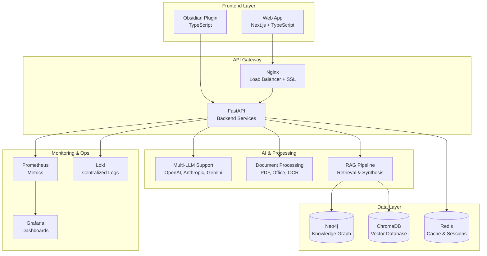

# �� KI-Wissenssystem - Enterprise Knowledge Management Platform

Ein intelligentes Wissensmanagementsystem für Compliance und IT-Sicherheit mit KI-gestützter Dokumentenverarbeitung und Knowledge Graph-Technologie.

> **🌐 Produktionsbereit**: Vollständige Web-Anwendung mit moderner React-UI und Enterprise-Features  
> **📔 Obsidian Plugin**: Verfügbar in separatem Branch für Obsidian-Integration

## 📋 Inhaltsverzeichnis

- [✨ Features](#-features)
- [🚀 Schnellstart](#-schnellstart)
- [🏭 Produktionsumgebung](#-produktionsumgebung)
- [🏗️ Architektur](#️-architektur)
- [📋 Voraussetzungen](#-voraussetzungen)
- [🛠️ Entwicklung](#️-entwicklung)
- [📖 Weitere Dokumentation](#-weitere-dokumentation)
- [🔧 Konfiguration](#-konfiguration)
- [🔄 Wartung & Support](#-wartung--support)

## ✨ Features

### 🌐 Web-App Frontend (Next.js + TypeScript)
- 📱 **Responsive Design** - Material Design 3 für alle Geräte
- 💬 **Multi-Chat System** - Mehrere Chat-Sessions mit Verlauf und Management
- 🕸️ **KI-gesteuerte Graph-Visualisierung** - Automatische Anzeige bei graph-relevanten Antworten
- 📄 **Drag & Drop Upload** - Einfacher Dokumentenupload mit Echtzeit-Analyse  
- ⚡ **Performance-optimiert** - Next.js 15 mit Turbopack
- 🌙 **Dark/Light Mode** - Moderne Benutzeroberfläche mit Theme-Unterstützung
- 🔍 **Erweiterte Suche** - Semantische und strukturierte Suche

### 🚀 Backend (Python/FastAPI)
- 🔍 **Intelligente Dokumentenverarbeitung** - BSI, ISO 27001, NIST CSF
- 🧠 **Multi-LLM Support** - OpenAI, Anthropic, Google Gemini, Ollama
- 🕸️ **Knowledge Graph** - Neo4j mit automatischer Verknüpfung
- 📊 **Vector Search** - ChromaDB für semantische Suche
- 🔒 **Enterprise Security** - JWT, Rate Limiting, CORS Protection
- 📈 **Monitoring** - Prometheus, Grafana, Loki für Production

### 🐳 Production Features
- 🔄 **Zero-Downtime Deployment** - Rolling Updates mit Rollback
- 📊 **Comprehensive Monitoring** - Gesundheitschecks und Performance-Metriken
- 🛡️ **Security Hardening** - Multi-Layered Authentication und Network Isolation
- 📦 **Automated Backups** - Tägliche Backups mit Disaster Recovery
- ⚖️ **Load Balancing** - Nginx mit SSL/TLS Termination
- 🔄 **Auto-Scaling** - Horizontale Skalierung für High-Availability

## 🚀 Schnellstart

### 🌐 Entwicklungsumgebung

1. **Backend Services starten**:
   ```bash
   cd ki-wissenssystem
   ./start-all.sh
   ```

2. **Web-App starten**:
   ```bash
   cd ki-wissenssystem-webapp
   npm install
   npm run dev
   ```

3. **🎉 Fertig!** Öffnen Sie http://localhost:3001

### 🏭 Produktionsumgebung

Für die vollständige Produktionsumgebung siehe [Produktions-Deployment Guide](PRODUCTION-DEPLOYMENT.md).

**Schnellstart Production:**
```bash
# 1. Setup ausführen
./production-setup.sh

# 2. Environment konfigurieren
cp production-env.template production.env
# Bearbeiten Sie production.env mit Ihren Werten

# 3. Deployment starten
./deploy.sh fresh
```

## 🏗️ Architektur



## 📋 Voraussetzungen

### Minimale Systemanforderungen
- **CPU**: 4 Cores
- **RAM**: 8GB (16GB empfohlen)
- **Storage**: 50GB SSD
- **Network**: Breitband-Internet für KI-APIs

### Software-Abhängigkeiten
- **Docker** & Docker Compose
- **Python 3.11+**
- **Node.js 18+**
- **Git**

### Betriebssystem-Support
- ✅ **Linux** (Ubuntu/Debian, CentOS/RHEL)
- ✅ **macOS** (Intel/Apple Silicon)
- ✅ **Windows** (Windows 10/11 mit WSL2)

## 🛠️ Entwicklung

### Entwicklungsumgebung einrichten

```bash
# Backend Development
cd ki-wissenssystem
./dev-mode.sh

# Frontend Development
cd ki-wissenssystem-webapp
npm run dev

# Beide Services parallel starten
make dev  # Siehe Makefile
```

### Testing

```bash
# Backend Tests
cd ki-wissenssystem
python -m pytest tests/

# Frontend Tests
cd ki-wissenssystem-webapp
npm test

# E2E Tests
npm run test:e2e
```

### Code Quality

```bash
# Linting & Formatting
make lint
make format

# Type Checking
make typecheck

# Security Scan
make security-check
```

## 📖 Weitere Dokumentation

| Dokument | Beschreibung |
|----------|-------------|
| [🏭 Production Deployment](PRODUCTION-DEPLOYMENT.md) | Vollständige Produktions-Setup Anleitung |
| [🔧 API Analyse](API-Analyse_und_Anpassungsempfehlungen.md) | Backend API Dokumentation und Empfehlungen |
| [🌐 Web-App Guide](README-WEBAPP.md) | Frontend-spezifische Dokumentation |
| [💻 Entwicklungsguide](ENTWICKLUNG.md) | Entwicklungsumgebung und Workflows |
| [🏗️ Workflow Dokumentation](WORKFLOW-DOKUMENTATION.md) | Entwicklungs- und Deployment-Prozesse |
| [🎯 Prototyp Status](PROTOTYP-FERTIGSTELLUNG.md) | Projektfortschritt und erreichte Milestones |
| [📋 Branch Struktur](BRANCH-STRUKTUR.md) | Git Branch Management |
| [📖 Dokumentationsübersicht](docs/README.md) | Zentrale Navigation aller Dokumentationen |

## 🔧 Konfiguration

### Environment Variables

**Development (.env):**
```env
# LLM Configuration
LLM_PROVIDER=ollama
LLM_MODEL=llama3.1:8b
OPENAI_API_KEY=your-openai-key

# Database URLs  
NEO4J_URI=bolt://localhost:7687
CHROMA_HOST=localhost
CHROMA_PORT=8000

# API Configuration
API_HOST=localhost
API_PORT=8000
CORS_ORIGINS=["http://localhost:3000"]
```

**Production (production.env):**
```env
# Siehe production-env.template für vollständige Konfiguration
NODE_ENV=production
SECURE_SSL_REDIRECT=true
RATE_LIMIT_ENABLED=true
MONITORING_ENABLED=true
BACKUP_ENABLED=true
```

### 🤖 KI-Modell Konfiguration

```bash
# Modell-Profile wechseln
./ki-wissenssystem/scripts/system/switch-model-profile.sh

# Verfügbare Profile:
# - development (Ollama lokal)
# - production-openai (OpenAI GPT-4)
# - production-anthropic (Claude Sonnet)
# - production-google (Gemini Pro)
```

### 🔒 Sicherheitskonfiguration

- **JWT Secrets**: Automatische Generierung bei Setup
- **SSL/TLS**: Let's Encrypt oder Custom Certificates
- **Rate Limiting**: API-basierte Limits
- **CORS**: Konfigurierbare Origins
- **Network Security**: Docker Network Isolation

## 🔄 Wartung & Support

### Monitoring & Health Checks

```bash
# System Status prüfen
./deploy.sh status

# Logs einsehen
./deploy.sh logs

# Performance Metriken
# Grafana Dashboard: http://your-domain:3001
```

### Backup & Recovery

```bash
# Manuelles Backup
./deploy.sh backup

# Wiederherstellung
./deploy.sh restore backup-timestamp

# Rollback auf letzte Version
./deploy.sh rollback
```

### Updates

```bash
# Sicherheits-Updates
./deploy.sh update

# Rolling Update (Zero-Downtime)
./deploy.sh update --rolling

# Hot-Fix Deployment
./deploy.sh hotfix
```

### Troubleshooting

**Häufige Probleme:**

1. **Port Konflikte**: Web-App läuft auf Port 3001 statt 3000
2. **Docker Issues**: `docker system prune` für Cleanup
3. **Memory Issues**: Erhöhen Sie die Docker Memory Limits
4. **SSL Certificate**: Let's Encrypt Renewal mit Certbot

**Support Kanäle:**
- 📖 **Dokumentation**: Siehe `/docs` Verzeichnis
- 🐛 **Issues**: GitHub Issues für Bug Reports
- 💬 **Discussions**: GitHub Discussions für Fragen

## 🏷️ Version & Branch Information

- **Current Branch**: `webapp-version` (Production-ready Web Application)
- **Main Branch**: `main` (Obsidian Plugin Version)
- **Version**: v2.0.0-enterprise
- **Last Updated**: 2024-06-25

---

**🎯 Status**: ✅ **Production Ready** - Vollständig getestet und deployment-bereit

Für technischen Support oder Fragen zur Implementierung siehe die verlinkte Dokumentation oder erstellen Sie ein GitHub Issue.