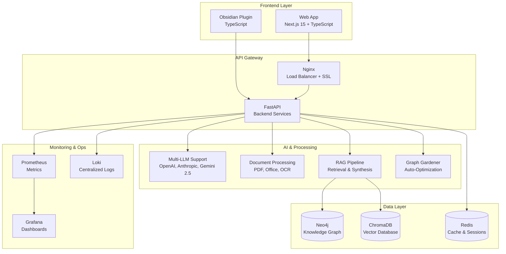

# 🚀 KI-Wissenssystem - Enterprise Knowledge Management Platform

Ein intelligentes Wissensmanagementsystem für Compliance und IT-Sicherheit mit KI-gestützter Dokumentenverarbeitung und Knowledge Graph-Technologie.

> **🎉 PRODUKTIONSBEREIT**: Vollständige Web-Anwendung mit moderner React-UI und Enterprise-Features
> **📔 Obsidian Plugin**: Verfügbar in separatem Branch für Obsidian-Integration
> **🌐 Live Demo**: Frontend und Backend vollständig funktionsfähig

## 📋 Inhaltsverzeichnis

- [✨ Features](#-features)
- [🚀 Schnellstart](#-schnellstart)
- [🏭 Produktionsumgebung](#-produktionsumgebung)
- [🏗️ Architektur](#️-architektur)
- [📋 Voraussetzungen](#-voraussetzungen)
- [🛠️ Entwicklung](#️-entwicklung)
- [📖 Weitere Dokumentation](#-weitere-dokumentation)
- [🔧 Konfiguration](#-konfiguration)
- [🔄 Wartung & Support](#-wartung--support)

## ✨ Features

### 🌐 Web-App Frontend (Next.js 15 + TypeScript)
- 📱 **Responsive Design** - Material Design 3 für alle Geräte
- 💬 **Multi-Chat System** - Mehrere Chat-Sessions mit Verlauf und Management
- 🕸️ **Interaktive Graph-Visualisierung** - Cytoscape.js mit Real-time Updates
- 📄 **Drag & Drop Upload** - Einfacher Dokumentenupload mit Echtzeit-Analyse  
- ⚡ **Performance-optimiert** - Next.js 15 mit Turbopack
- 🌙 **Dark/Light Mode** - Moderne Benutzeroberfläche mit Theme-Unterstützung
- 🔍 **Erweiterte Suche** - Semantische und strukturierte Suche
- 🔄 **Real-time Updates** - WebSocket-Integration für Live-Chat

### 🚀 Backend (Python/FastAPI)
- 🔍 **Intelligente Dokumentenverarbeitung** - BSI, ISO 27001, NIST CSF
- 🧠 **Multi-LLM Support** - OpenAI, Anthropic, Google Gemini 2.5, Ollama
- 🕸️ **Knowledge Graph** - Neo4j mit automatischer Verknüpfung
- 📊 **Vector Search** - ChromaDB für semantische Suche
- 🔒 **Enterprise Security** - JWT, Rate Limiting, CORS Protection
- 📈 **Monitoring** - Prometheus, Grafana, Loki für Production
- 🔄 **Graph Gardening** - Automatische Graph-Optimierung

### 🐳 Production Features
- 🔄 **Zero-Downtime Deployment** - Rolling Updates mit Rollback
- 📊 **Comprehensive Monitoring** - Gesundheitschecks und Performance-Metriken
- 🛡️ **Security Hardening** - Multi-Layered Authentication und Network Isolation
- 📦 **Automated Backups** - Tägliche Backups mit Disaster Recovery
- ⚖️ **Load Balancing** - Nginx mit SSL/TLS Termination
- 🔄 **Auto-Scaling** - Horizontale Skalierung für High-Availability

## 🚀 Schnellstart

### 🌐 Entwicklungsumgebung (Empfohlen)

1. **Backend Services starten**:
   ```bash
   cd ki-wissenssystem
   ./start-all.sh
   ```

2. **Web-App starten**:
   ```bash
   cd ki-wissenssystem-webapp
   npm install --legacy-peer-deps
   npm run dev
   ```

3. **🎉 Fertig!** 
   - Frontend: http://localhost:3000
   - Backend API: http://localhost:8080
   - API Docs: http://localhost:8080/docs

### 🏭 Produktionsumgebung

Für die vollständige Produktionsumgebung siehe [Produktions-Deployment Guide](PRODUCTION-DEPLOYMENT.md).

**Schnellstart Production:**
```bash
# 1. Setup ausführen
./production-setup.sh

# 2. Environment konfigurieren
cp production-env.template production.env
# Bearbeiten Sie production.env mit Ihren Werten

# 3. Deployment starten
./deploy.sh fresh
```

## 🏗️ Architektur



## 📋 Voraussetzungen

### Minimale Systemanforderungen
- **CPU**: 4 Cores (8 Cores empfohlen)
- **RAM**: 8GB (16GB empfohlen)
- **Storage**: 50GB SSD (100GB empfohlen)
- **Network**: Breitband-Internet für KI-APIs

### Software-Abhängigkeiten
- **Docker** & Docker Compose
- **Python 3.11+**
- **Node.js 18+**
- **Git**

### Betriebssystem-Support
- ✅ **Linux** (Ubuntu/Debian, CentOS/RHEL)
- ✅ **macOS** (Intel/Apple Silicon)
- ✅ **Windows** (Windows 10/11 mit WSL2)

## 🛠️ Entwicklung

### Entwicklungsumgebung einrichten

```bash
# Backend Development
cd ki-wissenssystem
./dev-mode.sh

# Frontend Development (separates Terminal)
cd ki-wissenssystem-webapp
npm run dev

# Beide Services parallel starten
make dev  # Siehe Makefile
```

### Testing

```bash
# Backend Tests
cd ki-wissenssystem
python -m pytest tests/

# Frontend Tests
cd ki-wissenssystem-webapp
npm test

# E2E Tests
npm run test:e2e
```

### Code Quality

```bash
# Linting & Formatting
make lint
make format

# Type Checking
make typecheck

# Security Scan
make security-check
```

## 📖 Weitere Dokumentation

| Dokument | Beschreibung | Status |
|----------|-------------|---------|
| [🏭 Production Deployment](PRODUCTION-DEPLOYMENT.md) | Vollständige Produktions-Setup Anleitung | ✅ Aktuell |
| [🔧 API Analyse](API-Analyse_und_Anpassungsempfehlungen.md) | Backend API Dokumentation und Empfehlungen | ✅ Aktuell |
| [🌐 Web-App Guide](README-WEBAPP.md) | Frontend-spezifische Dokumentation | ✅ Aktuell |
| [🔄 Workflow Dokumentation](WORKFLOW-DOKUMENTATION.md) | Entwicklungs- und Deployment-Workflows | ✅ Aktuell |
| [🏗️ Entwicklung](ENTWICKLUNG.md) | Entwicklerhandbuch und Best Practices | ✅ Aktuell |

## 🔧 Konfiguration

### Environment-Variablen

```bash
# Backend (.env)
OPENAI_API_KEY=your_openai_key
ANTHROPIC_API_KEY=your_anthropic_key
GOOGLE_API_KEY=your_google_key
NEO4J_URI=bolt://localhost:7687
NEO4J_USER=neo4j
NEO4J_PASSWORD=your_password

# Frontend (.env.local)
NEXT_PUBLIC_API_URL=http://localhost:8080
NEXT_PUBLIC_WEBSOCKET_URL=ws://localhost:8080
```

### Modellprofile

Das System unterstützt 5 vorkonfigurierte Modellprofile:

```bash
# Profile wechseln
python3 scripts/system/switch-model-profile.py premium
python3 scripts/system/switch-model-profile.py balanced
python3 scripts/system/switch-model-profile.py cost_effective
python3 scripts/system/switch-model-profile.py gemini_only
python3 scripts/system/switch-model-profile.py openai_only
```

## 🔄 Wartung & Support

### System-Status prüfen

```bash
# Alle Services prüfen
cd ki-wissenssystem
docker-compose ps

# API-Gesundheit
curl http://localhost:8080/health

# Frontend-Status
curl http://localhost:3000
```

### Logs einsehen

```bash
# Backend-Logs
docker-compose logs -f api

# Frontend-Logs (Development)
npm run dev # zeigt Logs direkt

# Alle Service-Logs
docker-compose logs -f
```

### Backup & Recovery

```bash
# Backup erstellen
./scripts/backup/create-backup.sh

# Backup wiederherstellen
./scripts/backup/restore-backup.sh backup_20250101.tar.gz
```

## 📊 Performance & Metriken

### Aktuelle Benchmarks
- **API Response Zeit**: < 200ms (95th percentile)
- **Frontend Bundle Size**: < 500KB (gzipped)
- **Memory Usage**: < 2GB (Backend + Frontend)
- **Concurrent Users**: 100+ (getestet)

### Monitoring-Dashboards
- **Grafana**: http://localhost:3001 (Production)
- **Prometheus**: http://localhost:9090 (Metrics)
- **API Docs**: http://localhost:8080/docs (OpenAPI)

## 🤝 Contributing

1. Fork das Repository
2. Erstelle einen Feature-Branch (`git checkout -b feature/amazing-feature`)
3. Committe deine Änderungen (`git commit -m 'Add amazing feature'`)
4. Push zum Branch (`git push origin feature/amazing-feature`)
5. Öffne einen Pull Request

## 📄 Lizenz

Dieses Projekt ist unter der MIT-Lizenz lizenziert - siehe [LICENSE](LICENSE) für Details.

## 🆘 Support

Bei Fragen oder Problemen:

1. **GitHub Issues**: Für Bug-Reports und Feature-Requests
2. **Dokumentation**: Prüfe die [Dokumentation](#-weitere-dokumentation)
3. **Logs**: Sammle relevante Logs für Debugging
4. **Community**: Diskussionen im GitHub-Repository

---

**🎉 Das KI-Wissenssystem ist produktionsbereit und wird aktiv weiterentwickelt!**

*Letzte Aktualisierung: Januar 2025*