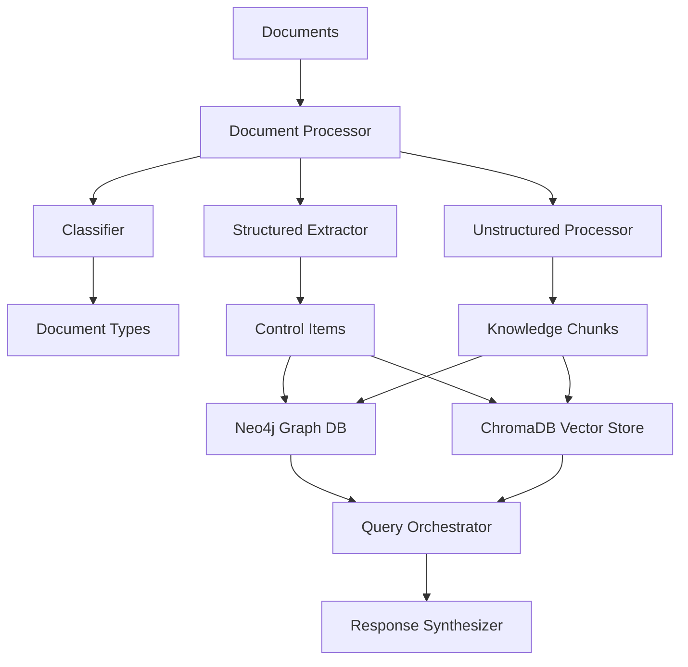
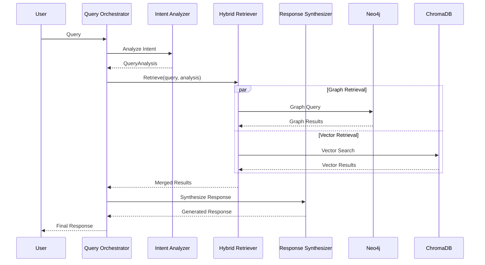

# Enterprise Data Model & Schema

*Consolidated from Legacy Archive (33KB+ DATENMODELL-DOKUMENTATION.md and component analysis)*

---

## 🎯 **Hybrid Data Architecture Overview**

The Neuronode uses a sophisticated hybrid data model combining structured graph databases with vector embeddings to enable both semantic search and complex relationship analysis.

### **System Architecture**


---

## 📋 **Document Types & Classification**

### **Supported Document Types**
| **Type** | **Description** | **Extraction Strategy** |
|----------|-----------------|------------------------|
| `BSI_GRUNDSCHUTZ` | BSI IT-Grundschutz Documents | Structured Control Extraction |
| `BSI_C5` | BSI Cloud Computing Compliance Controls | Structured Control Extraction |
| `ISO_27001` | ISO 27001 Standard Documents | Structured Control Extraction |
| `NIST_CSF` | NIST Cybersecurity Framework | Structured Control Extraction |
| `WHITEPAPER` | Technical Whitepapers | Unstructured Chunk Extraction |
| `TECHNICAL_DOC` | Technical Documentation | Unstructured Chunk Extraction |
| `FAQ` | Frequently Asked Questions | Unstructured Chunk Extraction |
| `UNKNOWN` | Non-classifiable | Fallback Processing |

### **Supported File Formats**
| **Format** | **Loader** | **Processing Capabilities** |
|------------|------------|---------------------------|
| PDF | `PDFLoader` | Text + Metadata Extraction |
| DOCX | `OfficeLoader` | Paragraphs + Tables |
| XLSX | `OfficeLoader` | Spreadsheet Data + Formulas |
| PPTX | `OfficeLoader` | Slide Content |
| TXT | `TextLoader` | Plain Text |
| XML | `XMLLoader` | Structured Data |

---

## 🏗️ **Data Models**

### **Structured Extraction (Compliance Documents)**

#### **ControlItem Model**
```python
class ControlItem(BaseModel):
    id: str                    # e.g. "OPS.1.1.A1", "C5-01"
    title: str                 # Control title
    text: str                  # Full description
    level: Optional[str]       # "Basis", "Standard", "Hoch"
    domain: Optional[str]      # "OPS", "IDM", "SYS"
    source: str               # Source document
    metadata: Dict[str, Any]   # Additional metadata
```

**Extraction Patterns:**
- **BSI Grundschutz:** `([A-Z]{3,4}\.\d+(?:\.\d+)*\.A\d+)\s*([^\n]+)`
- **BSI C5:** `([A-Z]{2,3}-\d{2})\s*([^\n]+)`
- **ISO 27001:** LLM-based extraction with specialized prompts
- **NIST CSF:** LLM-based extraction with framework context

### **Unstructured Extraction (Technical Documents)**

#### **KnowledgeChunk Model**
```python
class KnowledgeChunk(BaseModel):
    id: str                           # Unique chunk ID
    text: str                         # Chunk content
    summary: str                      # LLM-generated summary
    keywords: List[str]               # Extracted keywords
    entities: List[str]               # Recognized entities (technologies, standards)
    relationships: List[Dict[str, Any]] # Potential relationships
    source: str                       # Source document
    page: Optional[int]               # Page number (if available)
    metadata: Dict[str, Any]          # Additional metadata
```

**Chunk Processing Pipeline:**
1. **Smart Chunking:** Adaptive chunk size based on document structure
2. **LLM Analysis:** Gemini 2.5 Flash for summarization and keyword extraction
3. **Entity Recognition:** Detection of technologies, standards, products
4. **Relationship Detection:** Identification of potential relationships to controls

---

## 🗄️ **Neo4j Graph Database Schema**

### **Node Types**
| **Node Type** | **Properties** | **Purpose** |
|---------------|----------------|-------------|
| `:ControlItem` | id, title, text, level, domain, source | Compliance requirements |
| `:KnowledgeChunk` | id, text, summary, keywords, source, page | Knowledge fragments |
| `:Technology` | name, category, vendor | Technology entities |
| `:Entity` | name, type | General entities |
| `:Document` | filename, hash, document_type, standard_name | Document metadata |

### **Relationship Types**
| **Relationship** | **Source** | **Target** | **Meaning** | **Properties** |
|------------------|------------|------------|-------------|----------------|
| `:IMPLEMENTS` | Technology | ControlItem | Technology implements control | confidence |
| `:SUPPORTS` | KnowledgeChunk | ControlItem | Chunk supports control | confidence, reason |
| `:REFERENCES` | KnowledgeChunk | ControlItem | Chunk references control | confidence |
| `:MAPS_TO` | ControlItem | ControlItem | Standard mapping | mapping_type |
| `:RELATES_TO` | Any | Any | General relationship | confidence, type |
| `:MENTIONS` | KnowledgeChunk | Entity | Chunk mentions entity | frequency |
| `:CONTAINS` | Document | KnowledgeChunk/ControlItem | Document contains element | - |
| `:SUPERSEDES` | Document | Document | Version relationship | - |

### **Database Constraints & Indexes**
```cypher
-- Uniqueness constraints
CREATE CONSTRAINT control_id FOR (c:ControlItem) REQUIRE c.id IS UNIQUE;
CREATE CONSTRAINT chunk_id FOR (k:KnowledgeChunk) REQUIRE k.id IS UNIQUE;
CREATE CONSTRAINT tech_name FOR (t:Technology) REQUIRE t.name IS UNIQUE;
CREATE CONSTRAINT doc_hash FOR (d:Document) REQUIRE d.hash IS UNIQUE;

-- Performance indexes
CREATE INDEX control_domain FOR (c:ControlItem) ON (c.domain);
CREATE INDEX control_source FOR (c:ControlItem) ON (c.source);
CREATE INDEX chunk_source FOR (k:KnowledgeChunk) ON (k.source);
CREATE INDEX doc_type FOR (d:Document) ON (d.document_type);
```

---

## 🔍 **ChromaDB Vector Storage**

### **Collections Schema**
| **Collection** | **Content** | **Embedding Model** | **Purpose** |
|----------------|-------------|---------------------|-------------|
| `compliance_docs` | BSI, ISO, NIST Controls | Gemini Embedding-001 | Compliance search |
| `technical_docs` | Whitepapers, Tech docs | Gemini Embedding-001 | Technical search |
| `general_knowledge` | General chunks | Gemini Embedding-001 | Fallback search |

### **Metadata Schema**
```python
{
    "source": str,           # Source document
    "page": str,             # Page number (as string)
    "summary": str,          # Summary
    "keywords": str,         # Comma-separated keywords
    "document_type": str,    # Document type
    "chunk_id": str,         # Chunk identifier
    "processing_date": str,  # Processing date
    "confidence": str        # Extraction confidence
}
```

---

## 🔧 **Query Processing & Data Flow**

### **Query Orchestrator Pipeline**


### **Data Processing Workflow**
```yaml
Document Ingestion:
  1. File Upload & Validation
  2. Document Classification (LLM + patterns)
  3. Content Extraction (format-specific loaders)
  4. Metadata Extraction (title, author, dates)
  
Structured Processing (Controls):
  1. Pattern-based extraction (regex + rules)
  2. LLM validation and enhancement
  3. Control normalization and standardization
  4. Neo4j storage with relationships
  
Unstructured Processing (Chunks):
  1. Smart text chunking (adaptive size)
  2. LLM analysis (summary, keywords, entities)
  3. Embedding generation (Gemini)
  4. ChromaDB storage with metadata
  
Relationship Discovery:
  1. Pattern-based connections (fast)
  2. Similarity-based matching (medium)
  3. LLM-based analysis (slow, high quality)
  4. Confidence scoring and validation
```

---

## 📊 **Data Quality & Validation**

### **Quality Assurance Pipeline**
```yaml
Format Validation:
  - Document structure integrity
  - Required metadata presence
  - Content completeness checks
  
Content Validation:
  - Semantic consistency
  - Language detection and validation
  - Technical accuracy checks
  
Relationship Validation:
  - Confidence threshold enforcement (>0.7)
  - Cross-reference verification
  - Conflict detection and resolution
```

### **Performance Characteristics**
```yaml
Neo4j Operations:
  Node Creation: ~10ms per item
  Relationship Creation: ~5ms per relationship
  Complex Queries: 200-2000ms (depends on complexity)
  Batch Operations: 100 items per batch (optimized)
  
ChromaDB Operations:
  Embedding Generation: 200-800ms (API-dependent)
  Vector Search: 100-300ms
  Similarity Threshold: 0.7 minimum
  Collection Size Impact: Linear scaling up to 100K documents
```

---

## 🔐 **Data Security & Privacy**

### **Security Measures**
```yaml
Data Encryption:
  - At-rest encryption for all databases
  - TLS 1.3 for data in transit
  - API key encryption in environment variables
  
Access Control:
  - Role-based access to data collections
  - API authentication for all operations
  - Audit logging for data access
  
Privacy Compliance:
  - No personal data storage in knowledge base
  - Document metadata sanitization
  - GDPR-compliant data handling
```

### **Backup & Recovery**
```yaml
Backup Strategy:
  - Daily incremental backups
  - Weekly full backups
  - Point-in-time recovery capability
  
Data Retention:
  - Document versions: 1 year
  - Access logs: 90 days
  - Performance metrics: 6 months
```

---

## 🎯 **Future Data Model Enhancements**

### **Planned Improvements**
```yaml
Enhanced Semantics (Q1 2025):
  - Document-as-Node implementation
  - Contextual relationship models
  - Confidence scoring improvements
  
Advanced Analytics (Q2 2025):
  - Usage pattern analysis
  - Quality trend monitoring
  - Performance optimization
  
Enterprise Features (Q3 2025):
  - Multi-tenant data isolation
  - Advanced security controls
  - Compliance reporting
```

---

*This document consolidates data model information from the legacy DATENMODELL-DOKUMENTATION.md (33KB) and current system analysis. For implementation details, see the component documentation.*
