# 3. Workflows und Entwicklungsprozesse

## Überblick

Neuronode implementiert einen strukturierten 4-Phasen-Workflow von der Dokumenteingabe bis zur interaktiven Wissensabfrage. Dieses Dokument beschreibt alle wichtigen Entwicklungs-, Test- und Betriebsprozesse.

## 🛠️ **SYSTEM-MANAGEMENT**

### **Zentrales Management-Skript**
```bash
# Hauptskript für alle Operationen
./manage.sh [command]

# Verfügbare Kommandos:
start     # Alle Services starten
stop      # Alle Services stoppen  
restart   # System-Neustart
status    # Service-Status anzeigen
logs      # System-Logs anzeigen
health    # Gesundheitsprüfung
test      # Test-Suite ausführen
deploy    # Production Deployment
backup    # System-Backup
clean     # Temporäre Dateien löschen
```

### **Service-Management-Skripte**
| Skript | Plattform | Beschreibung |
|--------|-----------|--------------|
| `manage.sh start` | macOS/Linux | Vollständiger System-Start |
| `manage.sh stop` | macOS/Linux | Vollständiger System-Stop |
| `start-services.sh` | macOS/Linux | Nur Docker Services |
| `start-api.sh` | macOS/Linux | Nur API Server |
| `scripts/system/start-all.sh` | macOS/Linux | Legacy-Kompatibilität |

### **Entwicklungstools**
| Skript | Plattform | Beschreibung |
|--------|-----------|--------------|
| `scripts/setup/install-dev-tools.sh` | macOS/Linux | Entwicklungstools installieren |
| `scripts/dev/dev-mode.sh` | macOS/Linux | Entwicklungs-Modus |
| `scripts/cli/ki-cli.sh` | macOS/Linux | CLI Interface |

### **Model-Management**
| Skript | Plattform | Beschreibung |
|--------|-----------|--------------|
| `scripts/system/switch-model-profile.sh` | macOS/Linux | LiteLLM Profile wechseln |
| `scripts/system/test-temperature-optimization.py` | Alle | Temperature-Tests |

## 🔄 **DOKUMENTVERARBEITUNGS-WORKFLOW**

### **Phase 1: Upload & Erkennung**

```mermaid
graph TD
    A[📄 Dokument Upload] --> B[🔍 Dateityp-Erkennung]
    B --> C[📊 Dokument-Klassifikation]  
    C --> D[✅ Validierung]
    D --> E[💾 Temporäre Speicherung]
```


**Implementation:**
```bash
# Upload via Web-Interface
→ http://localhost:3000/upload

# Upload via API
curl -X POST "http://localhost:8001/documents/upload" \
  -F "file=@dokument.pdf"

# Upload via CLI
./scripts/cli/ki-cli.sh upload dokument.pdf
```

**Unterstützte Formate:**
- ✅ PDF (95% Erfolgsrate)
- ✅ DOCX (92% Erfolgsrate)  
- ✅ XLSX (90% Erfolgsrate)
- ✅ PPTX (88% Erfolgsrate)
- ✅ TXT (99% Erfolgsrate)
- ✅ XML (85% Erfolgsrate)

### **Phase 2: Intelligente Verarbeitung**

```mermaid
graph TD
    A[🧠 KI-Klassifikation] --> B[📝 Inhalts-Extraktion]
    B --> C[🔪 Intelligentes Chunking]
    C --> D[🏷️ Entitäts-Erkennung]  
    D --> E[🔗 Beziehungs-Analyse]
```


**Verarbeitungs-Pipeline:**
```python
# Dokumentverarbeitung starten
POST /api/documents/{id}/process

# Status überwachen
GET /api/documents/{id}/status
WebSocket /ws/documents/processing/{id}

# Ergebnisse abrufen  
GET /api/documents/{id}/results
```

### **Phase 3: Speicherung & Indexierung**

```mermaid
graph TD
    A[🗄️ Neo4j Graph] --> B[📊 ChromaDB Vektoren]
    B --> C[🔄 Redis Cache]
    C --> D[🌐 Web-Interface]
```


**Datenfluss:**
```bash
# Graph-Daten anzeigen
GET /api/graph/data

# Vektor-Suche
POST /api/query/vector

# Hybrid-Suche  
POST /api/query
```

### **Phase 4: Abfrage & Interaktion**

```mermaid
graph TD
    A[❓ Nutzer-Abfrage] --> B[🎯 Intent-Analyse]
    B --> C[🔍 Hybrid Retrieval]
    C --> D[🧠 KI-Antwort-Generierung]
    D --> E[📊 Visualisierung]
```


## 🧪 **TESTING-WORKFLOWS**

### **Unit Tests**
```bash
# Backend Python Tests
cd neuronode-backend
pytest tests/ -v --cov=src --cov-report=html

# Test-Coverage anzeigen
open htmlcov/index.html
```

### **Integration Tests**
```bash
# Vollständige Integration Tests
python scripts/comprehensive_phase3_testing.py

# Spezifische Komponenten-Tests
python scripts/test_intent_analyzer_performance.py
python scripts/test_query_orchestrator_integration.py
python scripts/test_document_features.py
```

### **E2E Tests**
```bash
# Frontend E2E Tests
cd neuronode-webapp
npm run test:e2e

# Spezifische E2E-Szenarien
npx playwright test user-journey-complete-workflow.spec.ts
npx playwright test performance-scalability.spec.ts
npx playwright test state-synchronization-race-conditions.spec.ts
```

### **Performance Tests**
```bash
# Real-Data Testing
python scripts/real_data_phase3_testing.py

# Explainability Tests
python scripts/test_explainability_features.py

# System-Validierung
python scripts/validate_phase3.py
```

## 🚀 **DEPLOYMENT-WORKFLOWS**

### **Development Deployment**
```bash
# Lokale Entwicklung starten
./manage.sh start

# Services einzeln prüfen
./manage.sh status
curl http://localhost:8001/health
curl http://localhost:4000/health
```

### **Production Deployment**
```bash
# Production Build
./manage.sh deploy

# Mit Production-Konfiguration
docker-compose -f deployment/docker-compose.production.yml up -d

# SSL & Security Setup
cp deployment/production-env.template .env
# Environment-Variablen konfigurieren
```

### **Backup & Recovery**
```bash
# System-Backup erstellen
./manage.sh backup

# Datenbank-Backups
docker exec neo4j neo4j-admin backup --backup-dir=/backups --name=graph-backup
docker exec postgres pg_dump neuronode > backup.sql
```

## 🔧 **ENTWICKLUNGS-WORKFLOWS**

### **Feature-Entwicklung**
```bash
# 1. Development Setup
./scripts/setup/install-dev-tools.sh

# 2. Feature Branch erstellen
git checkout -b feature/new-feature

# 3. Development-Modus starten
./scripts/dev/dev-mode.sh

# 4. Tests während Entwicklung
npm run test:watch        # Frontend
pytest tests/ --watch    # Backend
```

### **Code Quality**
```bash
# Frontend Code Quality
cd neuronode-webapp
npm run lint
npm run type-check
npm run format

# Backend Code Quality  
cd neuronode-backend
black src/
isort src/
flake8 src/
mypy src/
```

### **LiteLLM Model-Management**
```bash
# Model-Profile anzeigen
./scripts/system/switch-model-profile.sh --show

# Profile wechseln
./scripts/system/switch-model-profile.sh premium    # Beste Qualität
./scripts/system/switch-model-profile.sh balanced   # Empfohlen
./scripts/system/switch-model-profile.sh cost_effective  # Günstig

# Model Performance testen
python scripts/system/test-temperature-optimization.py
```

## 📊 **MONITORING-WORKFLOWS**

### **System Health Monitoring**
```bash
# Allgemeine Gesundheitsprüfung
./manage.sh health

# Service-spezifische Checks
curl http://localhost:8001/health      # Backend API
curl http://localhost:4000/health      # LiteLLM Proxy  
curl http://localhost:8000/api/v1/     # ChromaDB
```

### **Performance Monitoring**
```bash
# System-Metriken
curl http://localhost:8001/metrics

# LiteLLM Analytics
open http://localhost:4000/ui

# Database Performance
docker exec neo4j cypher-shell "CALL dbms.queryJmx('java.lang:type=Memory')"
```

### **Log-Analyse**
```bash
# Alle Service-Logs
./manage.sh logs

# Spezifische Service-Logs
docker-compose logs -f backend
docker-compose logs -f litellm-proxy
docker-compose logs -f neo4j
```

## 🛠️ **MAINTENANCE-WORKFLOWS**

### **Regelmäßige Wartung**
```bash
# Wöchentlich: System-Cleanup
./manage.sh clean

# Monatlich: Backup & Health Check
./manage.sh backup
./manage.sh health

# Bei Bedarf: Cache-Reset
docker exec redis redis-cli FLUSHALL
```

### **Update-Prozess**
```bash
# 1. Backup erstellen
./manage.sh backup

# 2. Services stoppen
./manage.sh stop

# 3. Code aktualisieren
git pull origin main

# 4. Dependencies aktualisieren
pip install -r requirements.txt
npm ci

# 5. Services starten
./manage.sh start

# 6. Health Check
./manage.sh health
```

## 📋 **TROUBLESHOOTING-WORKFLOWS**

### **Häufige Probleme & Lösungen**

#### **Services starten nicht**
```bash
# 1. Port-Konflikte prüfen
lsof -i :8001 -i :4000 -i :7687 -i :8000

# 2. Docker-Status prüfen
docker-compose ps

# 3. Logs analysieren
./manage.sh logs

# 4. Services einzeln starten
docker-compose up backend
docker-compose up litellm-proxy
```

#### **API-Fehler**
```bash
# 1. Health-Endpoints prüfen
curl -v http://localhost:8001/health

# 2. Environment-Variablen validieren
grep -E "(API_KEY|SECRET)" .env

# 3. LiteLLM-Konfiguration prüfen
curl http://localhost:4000/models
```

#### **Performance-Probleme**
```bash
# 1. Resource-Usage prüfen
docker stats

# 2. Database-Performance analysieren
python scripts/test_intent_analyzer_performance.py

# 3. Cache-Status prüfen
docker exec redis redis-cli INFO memory
```

## 📈 **QUALITÄTSSICHERUNGS-WORKFLOWS**

### **Vor jedem Release**
```bash
# 1. Vollständige Test-Suite
npm run test:e2e
pytest tests/ -v

# 2. Performance-Validierung  
python scripts/comprehensive_phase3_testing.py

# 3. Security-Scan
npm audit
safety check

# 4. Documentation-Update
# Alle MD-Dateien auf Aktualität prüfen
```

### **Kontinuierliche Integration**
```bash
# Git Pre-Commit Hooks
pre-commit run --all-files

# Automated Testing Pipeline
# - Unit Tests: pytest + jest
# - Integration Tests: API + Database
# - E2E Tests: Playwright Browser Tests
# - Performance Tests: Load Testing
```

---

Diese Workflow-Dokumentation gewährleistet konsistente und effiziente Entwicklungs-, Test- und Betriebsprozesse für Neuronode. 