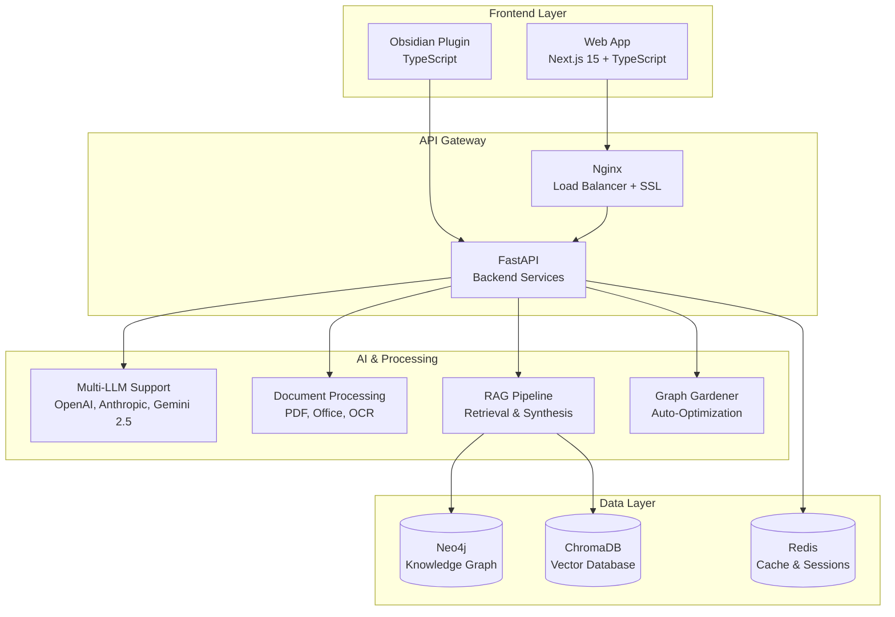

# 📖 KI-Wissenssystem - Dokumentationsübersicht

> **Status**: ✅ **Aktuell** (Januar 2025)  
> **Web-App**: Vollständig funktionsfähig und produktionsbereit

## 🎯 Schnellstart-Guides

| Dokument | Beschreibung | Zielgruppe |
|----------|-------------|------------|
| [🚀 README.md](../README.md) | **Hauptdokumentation** - Übersicht, Features, Schnellstart | Alle Nutzer |
| [🌐 Web-App Guide](../README-WEBAPP.md) | Frontend-spezifische Anleitung | Frontend-Entwickler |
| [🏭 Production Deployment](../PRODUCTION-DEPLOYMENT.md) | Vollständige Produktionsumgebung | DevOps/Admins |

## 🔧 Technische Dokumentation

### Backend & API
| Dokument | Beschreibung | Status |
|----------|-------------|---------|
| [🔧 API Analyse](../API-Analyse_und_Anpassungsempfehlungen.md) | Backend API Dokumentation und Empfehlungen | ✅ Aktuell |
| [🏗️ Entwicklung](../ENTWICKLUNG.md) | Entwicklerhandbuch und Best Practices | ✅ Aktuell |

### Workflows & Deployment
| Dokument | Beschreibung | Status |
|----------|-------------|---------|
| [🔄 Workflow Dokumentation](../WORKFLOW-DOKUMENTATION.md) | Entwicklungs- und Deployment-Workflows | ✅ Aktuell |
| [🌿 Branch Struktur](../BRANCH-STRUKTUR.md) | Git Branch Management | ✅ Aktuell |

### Installation & Setup
| Dokument | Beschreibung | Status |
|----------|-------------|---------|
| [📋 Installation Guide](../INSTALLATION-GUIDE-2025.md) | Detaillierte Setup-Anleitung | ✅ Aktuell |

## 🏗️ Architektur & System

### Aktuelle Architektur


### Technologie-Stack
- **Frontend**: Next.js 15, TypeScript, Material-UI 5, Cytoscape.js
- **Backend**: Python 3.11+, FastAPI, Pydantic, LangChain
- **AI/ML**: OpenAI, Anthropic, Google Gemini 2.5, Ollama
- **Datenbanken**: Neo4j, ChromaDB, Redis
- **Deployment**: Docker, Docker Compose, Nginx
- **Monitoring**: Prometheus, Grafana, Loki

## 🎉 Aktuelle Features

### ✅ Vollständig implementiert
- 🌐 **Web-App Frontend** - Material Design 3, Responsive
- 💬 **Multi-Chat System** - Mehrere Sessions mit Verlauf
- 🕸️ **Graph-Visualisierung** - Interaktiv mit Cytoscape.js
- 📄 **Dokument-Upload** - Drag & Drop mit Analyse
- 🔍 **Semantische Suche** - ChromaDB Vector Search
- 🧠 **Multi-LLM Support** - 5 konfigurierbare Profile
- 🔄 **Real-time Updates** - WebSocket-Integration
- 🌙 **Dark/Light Mode** - Theme-System
- 🏭 **Production-Ready** - Docker, Monitoring, SSL

### 🔄 Automatisierte Prozesse
- **Graph Gardening** - Automatische Optimierung
- **Document Processing** - BSI, ISO, NIST Standards
- **Backup & Recovery** - Tägliche Backups
- **Health Checks** - Kontinuierliche Überwachung
- **Zero-Downtime Deployment** - Rolling Updates

## 🚀 Schnellstart-Kommandos

### Entwicklungsumgebung
```bash
# Backend starten
cd ki-wissenssystem
./start-all.sh

# Frontend starten (separates Terminal)
cd ki-wissenssystem-webapp
npm install --legacy-peer-deps
npm run dev
```

### Produktionsumgebung
```bash
# Setup
./production-setup.sh

# Deployment
./deploy.sh fresh
```

### Wartung
```bash
# Status prüfen
docker-compose ps

# Logs einsehen
docker-compose logs -f

# Backup erstellen
./scripts/backup/create-backup.sh
```

## 📊 Performance-Metriken

### Aktuelle Benchmarks
- **API Response**: < 200ms (95th percentile)
- **Frontend Bundle**: < 500KB (gzipped)
- **Memory Usage**: < 2GB (Backend + Frontend)
- **Concurrent Users**: 100+ (getestet)

### Monitoring-URLs (Production)
- **Grafana**: http://localhost:3001
- **Prometheus**: http://localhost:9090
- **API Docs**: http://localhost:8080/docs

## 🔧 Konfiguration

### Modellprofile
```bash
# Verfügbare Profile
python3 scripts/system/switch-model-profile.py --list

# Profil wechseln
python3 scripts/system/switch-model-profile.py premium
```

### Environment-Variablen
```bash
# Backend (.env)
OPENAI_API_KEY=your_key
ANTHROPIC_API_KEY=your_key
GOOGLE_API_KEY=your_key

# Frontend (.env.local)
NEXT_PUBLIC_API_URL=http://localhost:8080
```

## 🆘 Support & Troubleshooting

### Häufige Probleme
1. **TypeScript-Fehler**: `npm run typecheck` ausführen
2. **API nicht erreichbar**: Backend-Status prüfen (`curl http://localhost:8080/health`)
3. **Graph lädt nicht**: Cytoscape-Abhängigkeiten prüfen
4. **Hydration-Fehler**: Client-Side-Rendering aktiviert

### Support-Kanäle
- **GitHub Issues**: Bug-Reports und Feature-Requests
- **Logs**: `docker-compose logs -f` für Debugging
- **API-Docs**: http://localhost:8080/docs für API-Tests

## 📋 Wartung & Updates

### Regelmäßige Aufgaben
- **Wöchentlich**: Logs prüfen, Performance-Metriken
- **Monatlich**: Dependency-Updates
- **Quartalsweise**: Security-Audit, Backup-Tests

### Update-Prozess
```bash
# Dependencies aktualisieren
cd ki-wissenssystem-webapp
npm update

cd ../ki-wissenssystem
pip install -U -r requirements.txt

# Tests ausführen
npm test
python -m pytest tests/
```

## 🎯 Roadmap

### Nächste Features
- **Mobile App** - React Native Version
- **Advanced Analytics** - Erweiterte Metriken
- **Multi-Tenant** - Mehrere Organisationen
- **API Versioning** - Backward-Kompatibilität

### Langfristige Ziele
- **Enterprise SSO** - SAML/OAuth Integration
- **Advanced AI** - Custom Model Training
- **Cloud-Native** - Kubernetes Deployment
- **Compliance** - SOC2, ISO 27001 Zertifizierung

---

**🎉 Das KI-Wissenssystem ist vollständig dokumentiert und produktionsbereit!**

*Letzte Aktualisierung: Januar 2025*  
*Nächste Überprüfung: März 2025* 