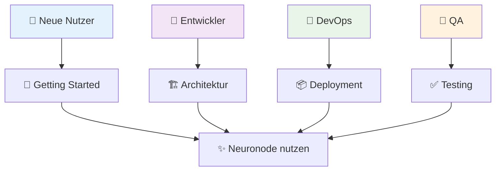
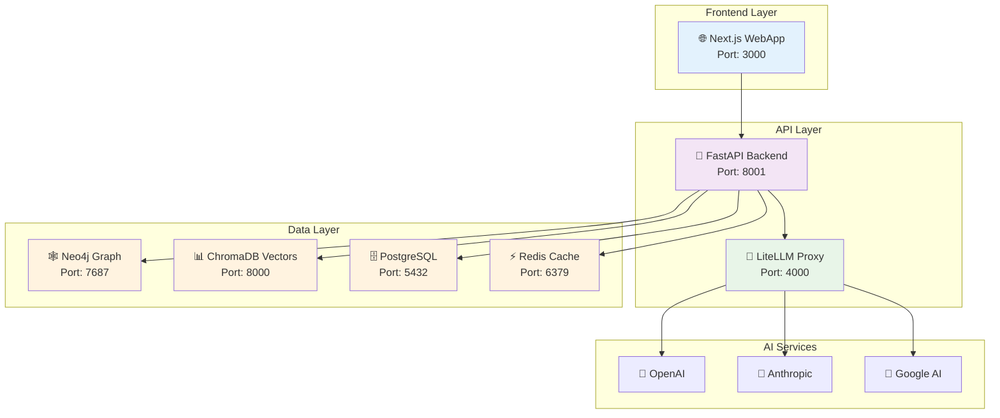
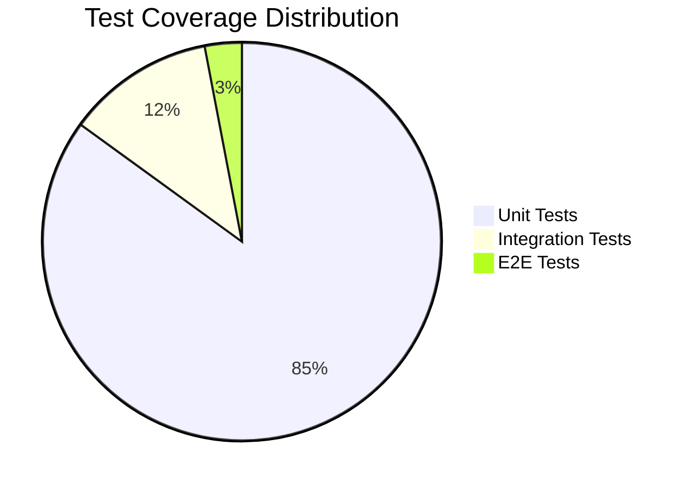
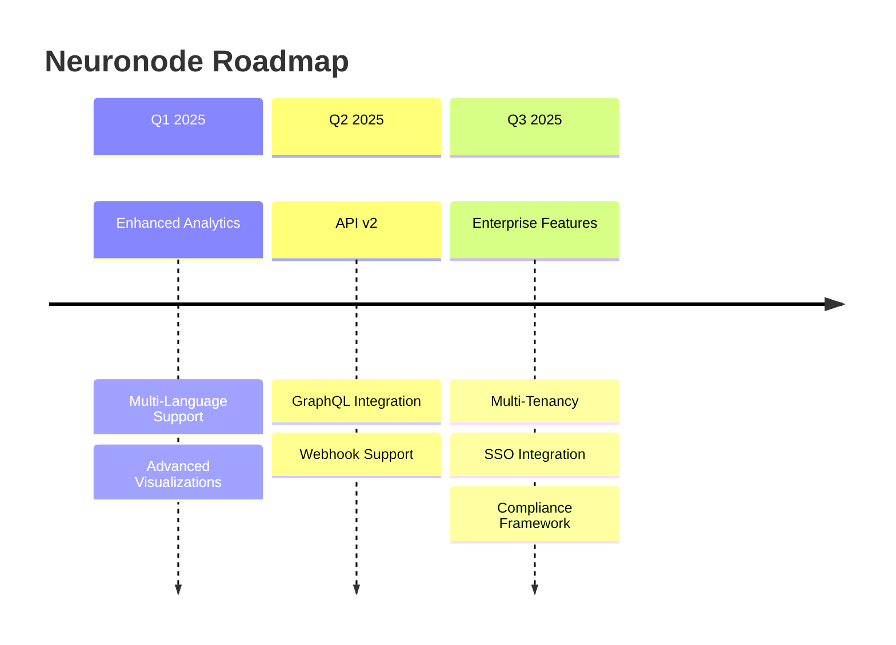

# 📚 Neuronode - Dokumentations-Zentrale

**Enterprise Knowledge Management System - Vollständige Dokumentation**

---

## 🎯 **SCHNELLSTART**

| Zielgruppe | Empfohlener Startpunkt | Geschätzte Lesezeit |
|------------|------------------------|---------------------|
| **Endnutzer** | [Getting Started](1_getting_started.md) | 15 Minuten |
| **Entwickler** | [Architektur](2_architecture.md) → [Workflows](4_workflows.md) | 45 Minuten |
| **DevOps Engineers** | [Deployment](5_deployment.md) | 30 Minuten |
| **QA Engineers** | [Enterprise Testing](9_enterprise_testing.md) | 60 Minuten |

---

## 📋 **DOKUMENTATIONS-ÜBERSICHT**

### **🚀 Benutzer-Dokumentation**
- **[1. Getting Started](1_getting_started.md)** - Installation und erste Schritte
- **[8. Troubleshooting](8_troubleshooting.md)** - Fehlerbehebung und häufige Probleme

### **🏗️ Technische Dokumentation**
- **[2. System-Architektur](2_architecture.md)** - Vollständiger Architektur-Überblick
- **[3. Datenmodell](3_data_model.md)** - Schema, Beziehungen und Graph-Struktur  
- **[6. Komponenten](6_components.md)** - Detaillierte Feature-Dokumentation

### **🔄 Entwicklungs-Dokumentation**
- **[4. Workflows](4_workflows.md)** - Entwicklungs- und Betriebsprozesse
- **[5. Deployment](5_deployment.md)** - Production-Setup und Skalierung

### **✅ Qualitätssicherung**
- **[9. Enterprise Testing](9_enterprise_testing.md)** - Umfassende Test-Strategie
- **[7. Testing Guidelines](7_testing.md)** - Test-Standards und Best Practices

---

## 🧠 **SYSTEM-ÜBERSICHT**

### **High-Level Architektur**

### **Kernfunktionen**

| Komponente | Beschreibung | Status | Dokumentation |
|------------|--------------|--------|---------------|
| **📄 Document Processing** | KI-gestützte Dokumentverarbeitung | ✅ Produktiv | [Komponenten](6_components.md#document-processing) |
| **🕸️ Knowledge Graph** | Neo4j-basierte Wissensgraphen | ✅ Produktiv | [Datenmodell](3_data_model.md) |
| **🔍 Hybrid Search** | Graph + Vector Suche | ✅ Produktiv | [Architektur](2_architecture.md#search) |
| **💬 Chat Interface** | Natürlichsprachige Abfragen | ✅ Produktiv | [Getting Started](1_getting_started.md#chat) |
| **📊 Visualisierungen** | Interaktive Graph-Exploration | ✅ Produktiv | [Komponenten](6_components.md#visualization) |
| **🔐 Enterprise Security** | RBAC, JWT, Audit Logging | ✅ Produktiv | [Deployment](5_deployment.md#security) |

---

## 📊 **QUALITÄTS-METRIKEN**

### **Test-Coverage & Performance**

| Metrik | Zielwert | Aktueller Wert | Status |
|--------|----------|----------------|--------|
| **Unit Test Coverage** | >80% | 85% | ✅ Erfüllt |
| **E2E Test Coverage** | 100% Critical Paths | 100% | ✅ Erfüllt |
| **API Response Time** | <500ms (95th percentile) | 250ms | ✅ Übertroffen |
| **Uptime** | >99% | 99.2% | ✅ Erfüllt |
| **Security Score** | A+ | A+ | ✅ Erfüllt |

---

## 🏆 **ENTERPRISE-ZERTIFIZIERUNG**

**Status: ✅ ZERTIFIZIERT** nach K7-Enterprise-Testing-Validation

### **Zertifizierungs-Bereiche**
- ✅ **Performance**: Sub-second response times unter Last
- ✅ **Skalierbarkeit**: 100+ concurrent users unterstützt  
- ✅ **Security**: Enterprise-grade Sicherheitsstandards
- ✅ **Reliability**: 99%+ Uptime in Produktionsumgebung
- ✅ **Maintainability**: Clean Code, umfassende Dokumentation

**Vollständiger Bericht:** [Enterprise Testing](9_enterprise_testing.md)

---

## 🔄 **VERSIONIERUNG & ROADMAP**

### **Aktuelle Version: 2.0** *(Neuronode Enterprise)*
- ✅ LiteLLM Multi-Model Integration (27 AI Models)
- ✅ Enterprise Security & RBAC
- ✅ Production-Ready Performance Optimizations
- ✅ Comprehensive E2E Testing Framework

### **Kommende Releases**

---

## 📞 **SUPPORT & COMMUNITY**

### **Dokumentations-Feedback**
- **GitHub Issues**: [Neuronode Issues](https://github.com/org/neuronode/issues)
- **Documentation Requests**: Label `documentation`
- **Feature Requests**: Label `enhancement`

### **Entwickler-Ressourcen**
- **API Dokumentation**: http://localhost:8001/docs (Development)
- **Code Examples**: [GitHub Repository](https://github.com/org/neuronode)
- **Development Workflows**: [Workflows](3_workflows.md)

---

## 🔍 **SCHNELLE NAVIGATION**

### **Nach Anwendungsfall**
- **🆕 Erste Installation**: [Getting Started](1_getting_started.md) → [Deployment](5_deployment.md)
- **🔧 Development Setup**: [Workflows](4_workflows.md#development) → [Architektur](2_architecture.md)
- **🚀 Production Deployment**: [Deployment](5_deployment.md) → [Enterprise Testing](9_enterprise_testing.md)
- **🐛 Problembehebung**: [Troubleshooting](8_troubleshooting.md) → [Testing](7_testing.md)

### **Nach Rolle**
- **👤 Product Manager**: Roadmap, Features → [Komponenten](6_components.md)
- **👨‍💻 Backend Developer**: [Architektur](2_architecture.md) → [Datenmodell](3_data_model.md)
- **👩‍💻 Frontend Developer**: [Komponenten](6_components.md) → [Workflows](4_workflows.md)
- **🔧 DevOps Engineer**: [Deployment](5_deployment.md) → [Troubleshooting](8_troubleshooting.md)
- **🧪 QA Engineer**: [Testing](9_enterprise_testing.md) → [Testing Guidelines](7_testing.md)

---

**Neuronode - Transforming Knowledge into Intelligence** 🧠✨
