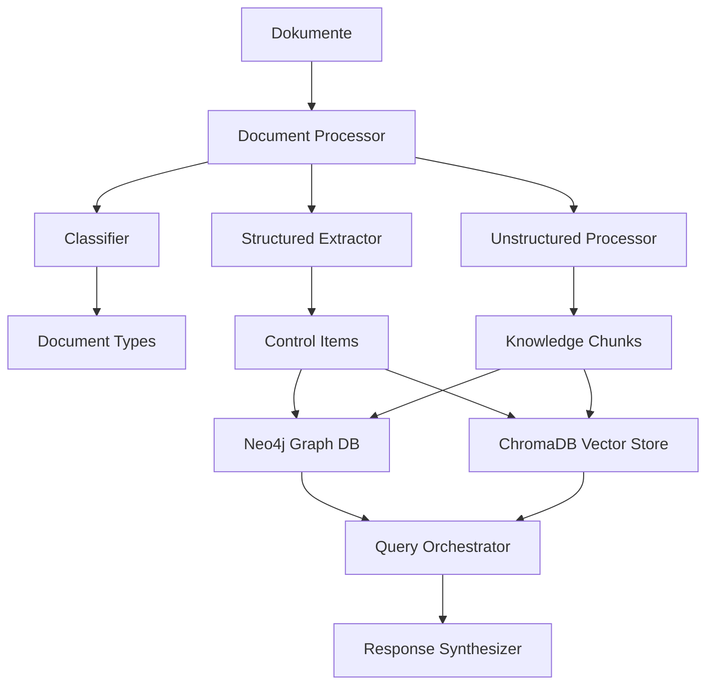
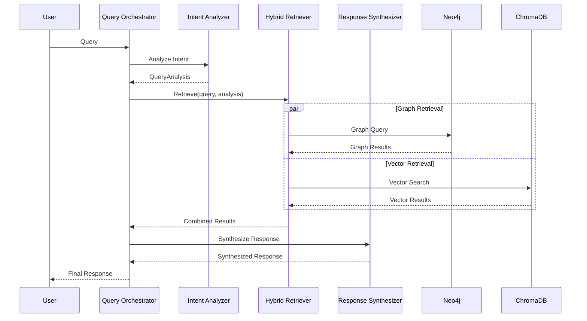

# 📊 Neuronode Datenmodell-Dokumentation

**Version:** 1.0  
**Datum:** Januar 2025  
**Autor:** Neuronode Team  

---

## 🎯 Überblick

Das Neuronode verwendet ein hybrides Datenmodell, das strukturierte Graph-Datenbanken mit Vektor-Embeddings kombiniert, um sowohl semantische Suche als auch komplexe Beziehungsanalysen zu ermöglichen.

### Architektur-Überblick



---

## 📋 Dokumenttypen und Klassifikation

### Unterstützte Dokumenttypen

| **Typ** | **Beschreibung** | **Extraktions-Strategie** |
|---------|------------------|---------------------------|
| `BSI_GRUNDSCHUTZ` | BSI IT-Grundschutz Dokumente | Strukturierte Control-Extraktion |
| `BSI_C5` | BSI Cloud Computing Compliance Controls | Strukturierte Control-Extraktion |
| `ISO_27001` | ISO 27001 Standard Dokumente | Strukturierte Control-Extraktion |
| `NIST_CSF` | NIST Cybersecurity Framework | Strukturierte Control-Extraktion |
| `WHITEPAPER` | Technische Whitepaper | Unstrukturierte Chunk-Extraktion |
| `TECHNICAL_DOC` | Technische Dokumentationen | Unstrukturierte Chunk-Extraktion |
| `FAQ` | Häufig gestellte Fragen | Unstrukturierte Chunk-Extraktion |
| `UNKNOWN` | Nicht klassifizierbar | Fallback-Verarbeitung |

### Unterstützte Dateiformate

| **Format** | **Loader** | **Verarbeitung** |
|------------|------------|------------------|
| PDF | `PDFLoader` | Text + Metadaten-Extraktion |
| DOCX | `OfficeLoader` | Paragraphen + Tabellen |
| XLSX | `OfficeLoader` | Tabellendaten + Formeln |
| PPTX | `OfficeLoader` | Folien-Inhalte |
| TXT | `TextLoader` | Plain-Text |
| XML | `XMLLoader` | Strukturierte Daten |

---

## 🎯 Datenextraktion

### Strukturierte Extraktion (Compliance-Dokumente)

#### Control Items
```python
class ControlItem(BaseModel):
    id: str                    # z.B. "OPS.1.1.A1", "C5-01"
    title: str                 # Control-Titel
    text: str                  # Vollständige Beschreibung
    level: Optional[str]       # "Basis", "Standard", "Hoch"
    domain: Optional[str]      # "OPS", "IDM", "SYS"
    source: str               # Quelldokument
    metadata: Dict[str, Any]   # Zusätzliche Metadaten
```

**Extraktions-Patterns:**
- **BSI Grundschutz:** `([A-Z]{3,4}\.\d+(?:\.\d+)*\.A\d+)\s*([^\n]+)`
- **BSI C5:** `([A-Z]{2,3}-\d{2})\s*([^\n]+)`
- **ISO 27001:** LLM-basierte Extraktion mit spezialisierten Prompts
- **NIST CSF:** LLM-basierte Extraktion mit Framework-Kontext

### Unstrukturierte Extraktion (Technische Dokumente)

#### Knowledge Chunks
```python
class KnowledgeChunk(BaseModel):
    id: str                           # Eindeutige Chunk-ID
    text: str                         # Chunk-Inhalt
    summary: str                      # LLM-generierte Zusammenfassung
    keywords: List[str]               # Extrahierte Schlüsselwörter
    entities: List[str]               # Erkannte Entitäten (Technologien, Standards)
    relationships: List[Dict[str, Any]] # Potentielle Beziehungen
    source: str                       # Quelldokument
    page: Optional[int]               # Seitennummer (falls verfügbar)
    metadata: Dict[str, Any]          # Zusätzliche Metadaten
```

**Chunk-Verarbeitung:**
1. **Smart Chunking:** Adaptive Chunk-Größe basierend auf Dokumentstruktur
2. **LLM-Analyse:** Gemini 2.5 Flash für Zusammenfassung und Keyword-Extraktion
3. **Entity Recognition:** Erkennung von Technologien, Standards, Produkten
4. **Relationship Detection:** Identifizierung potentieller Beziehungen zu Controls

---

## 🗄️ Datenspeicher-Architektur

### Neo4j Graph-Datenbank

#### Node-Typen

| **Node-Typ** | **Eigenschaften** | **Zweck** |
|--------------|-------------------|-----------|
| `:ControlItem` | id, title, text, level, domain, source | Compliance-Anforderungen |
| `:KnowledgeChunk` | id, text, summary, keywords, source, page | Wissens-Fragmente |
| `:Technology` | name, category, vendor | Technologie-Entitäten |
| `:Entity` | name, type | Allgemeine Entitäten |

#### Beziehungstypen

| **Beziehung** | **Quelle** | **Ziel** | **Bedeutung** | **Eigenschaften** |
|---------------|------------|----------|---------------|-------------------|
| `:IMPLEMENTS` | Technology | ControlItem | Technologie implementiert Control | confidence |
| `:SUPPORTS` | KnowledgeChunk | ControlItem | Chunk unterstützt Control | confidence, reason |
| `:REFERENCES` | KnowledgeChunk | ControlItem | Chunk referenziert Control | confidence |
| `:MAPS_TO` | ControlItem | ControlItem | Standard-Mapping | mapping_type |
| `:RELATES_TO` | Any | Any | Allgemeine Beziehung | confidence, type |
| `:MENTIONS` | KnowledgeChunk | Entity | Chunk erwähnt Entität | frequency |
| `:CONFLICTS` | KnowledgeChunk | ControlItem | Widerspruch identifiziert | severity |

#### Constraints und Indizes
```cypher
-- Eindeutigkeit
CREATE CONSTRAINT control_id FOR (c:ControlItem) REQUIRE c.id IS UNIQUE;
CREATE CONSTRAINT chunk_id FOR (k:KnowledgeChunk) REQUIRE k.id IS UNIQUE;
CREATE CONSTRAINT tech_name FOR (t:Technology) REQUIRE t.name IS UNIQUE;

-- Performance-Indizes
CREATE INDEX control_domain FOR (c:ControlItem) ON (c.domain);
CREATE INDEX control_source FOR (c:ControlItem) ON (c.source);
CREATE INDEX chunk_source FOR (k:KnowledgeChunk) ON (k.source);
```

### ChromaDB Vektor-Speicher

#### Collections

| **Collection** | **Inhalt** | **Embedding-Modell** | **Zweck** |
|----------------|------------|----------------------|-----------|
| `compliance_docs` | BSI, ISO, NIST Controls | Gemini Embedding-001 | Compliance-Suche |
| `technical_docs` | Whitepapers, Tech-Docs | Gemini Embedding-001 | Technische Suche |
| `general_knowledge` | Allgemeine Chunks | Gemini Embedding-001 | Fallback-Suche |

#### Metadaten-Schema
```python
{
    "source": str,           # Quelldokument
    "page": str,             # Seitennummer (als String)
    "summary": str,          # Zusammenfassung
    "keywords": str,         # Komma-getrennte Keywords
    "document_type": str,    # Dokumenttyp
    "chunk_id": str,         # Chunk-Identifikator
    "processing_date": str,  # Verarbeitungsdatum
    "confidence": str        # Extraktions-Konfidenz
}
```

---

## 🔍 Query-Verarbeitung und LLM-Integration

### Query-Orchestrator Pipeline



### Intent-Analyse

#### Query-Intents
| **Intent** | **Beschreibung** | **Retrieval-Strategie** |
|------------|------------------|-------------------------|
| `COMPLIANCE_REQUIREMENT` | Anfrage nach spezifischen Controls | Graph-fokussiert |
| `TECHNICAL_IMPLEMENTATION` | Implementierungs-Details | Vector + Graph |
| `MAPPING_COMPARISON` | Standard-Vergleiche | Graph-Mappings |
| `BEST_PRACTICE` | Best-Practice-Empfehlungen | Vector-fokussiert |
| `SPECIFIC_CONTROL` | Spezifische Control-ID | Graph-direkt |
| `GENERAL_INFORMATION` | Allgemeine Informationen | Hybrid |

#### Entity-Extraktion
```python
{
    "controls": ["OPS.1.1.A1", "ISO-27001-A.12.1.1"],
    "technologies": ["Active Directory", "SIEM", "Firewall"],
    "standards": ["BSI Grundschutz", "ISO 27001", "NIST CSF"],
    "concepts": ["Backup", "Incident Response", "Access Control"],
    "vendors": ["Microsoft", "Splunk", "Palo Alto"]
}
```

### LLM-Modell-Konfiguration

#### Modell-Profile
| **Profil** | **Klassifikation** | **Extraktion** | **Synthese** | **Validierung** |
|------------|-------------------|----------------|--------------|-----------------|
| `premium` | Gemini 2.5 Flash | GPT-4.1 | Claude Opus 4 | GPT-4o + Claude Sonnet 4 |
| `balanced` | Gemini 2.5 Flash | GPT-4.1 | Gemini 2.5 Pro | O4-mini + Claude 3.7 Sonnet |
| `cost_effective` | Gemini 2.5 Flash Lite | GPT-4o Mini | Gemini 2.0 Flash | GPT-4o Mini + Claude 3.5 Haiku |

#### Temperatur-Optimierungen (2025)
- **Klassifikation:** 0.0-0.1 (Deterministische Kategorisierung)
- **Extraktion:** 0.2 (Strukturierte Daten-Extraktion)
- **Validierung:** 0.2-0.3 (Analytische Bewertung)
- **Synthese:** 0.4-0.6 (Kreative aber kontrollierte Antworten)

---

## 📊 Graph-Visualisierung

### Node-Darstellung
```javascript
{
    id: "OPS.1.1.A1",
    label: "Ordnungsgemäße IT-Administration",
    type: "ControlItem",
    size: 25,  // Basierend auf Textlänge
    properties: {
        domain: "OPS",
        level: "Basis",
        source: "BSI IT-Grundschutz",
        // ... weitere Eigenschaften
    }
}
```

### Edge-Darstellung
```javascript
{
    source: "chunk_123",
    target: "OPS.1.1.A1",
    type: "IMPLEMENTS",
    weight: 0.85,
    properties: {
        confidence: 0.85,
        reason: "Beschreibt konkrete Umsetzung",
        created_by: "graph_gardener"
    }
}
```

### Graph-Metriken
- **Knoten-Anzahl:** Aufgeteilt nach Typ (ControlItem, KnowledgeChunk, Technology, Entity)
- **Beziehungs-Anzahl:** Aufgeteilt nach Typ (IMPLEMENTS, SUPPORTS, MAPS_TO, etc.)
- **Orphan-Knoten:** Knoten ohne Verbindungen
- **Cluster-Koeffizient:** Vernetzungsgrad
- **Zentrale Knoten:** Hochvernetzte Controls/Chunks

---

## 🔧 Graph Gardener - Automatische Optimierung

### Funktionen

#### 1. Orphan-Node-Erkennung
```python
def get_orphan_nodes(min_connections: int = 1) -> List[Dict]:
    """Findet Knoten mit wenigen/keinen Verbindungen"""
    query = """
    MATCH (n)
    WHERE NOT n:Entity
    WITH n, COUNT{(n)-[]->()} + COUNT{(n)<-[]-()} as connections
    WHERE connections <= $min_connections
    RETURN n, connections
    """
```

#### 2. Automatische Beziehungs-Erstellung
- **Semantische Ähnlichkeit:** ChromaDB-Suche mit Schwellwert < 0.3
- **LLM-Validierung:** Beziehungstyp und Konfidenz-Bewertung
- **Domain-basiert:** Controls aus gleicher Domäne verknüpfen

#### 3. Beziehungs-Validierung
```python
relationship_types = {
    "IMPLEMENTS": "Text beschreibt Control-Umsetzung",
    "SUPPORTS": "Text unterstützt/ergänzt Control",
    "REFERENCES": "Text verweist auf Control",
    "CONFLICTS": "Text widerspricht Control",
    "NONE": "Keine relevante Beziehung"
}
```

---

## 📈 Datenqualität und Metriken

### Verarbeitungs-Metriken

#### Dokument-Verarbeitung
```python
{
    "filename": "BSI_Grundschutz_2024.pdf",
    "document_type": "BSI_GRUNDSCHUTZ",
    "processing_time": 45.2,  # Sekunden
    "extracted_controls": 156,
    "generated_chunks": 89,
    "confidence_scores": {
        "classification": 0.95,
        "extraction": 0.87,
        "validation": 0.92
    }
}
```

#### Speicher-Statistiken
```python
{
    "neo4j": {
        "total_nodes": 2847,
        "total_relationships": 1523,
        "node_types": {
            "ControlItem": 1205,
            "KnowledgeChunk": 1456,
            "Technology": 127,
            "Entity": 59
        },
        "relationship_types": {
            "IMPLEMENTS": 342,
            "SUPPORTS": 567,
            "MAPS_TO": 89,
            "RELATES_TO": 525
        }
    },
    "chromadb": {
        "total_documents": 2661,
        "collections": {
            "compliance_docs": 1205,
            "technical_docs": 891,
            "general_knowledge": 565
        }
    }
}
```

### Qualitäts-Validierung

#### Control-Validierung
- **Vollständigkeit:** ID, Titel, Text vorhanden
- **Format-Konformität:** ID entspricht Standard-Pattern
- **Duplikat-Erkennung:** Gleiche IDs oder sehr ähnliche Inhalte
- **Referenz-Integrität:** Verweise auf andere Controls existieren

#### Chunk-Validierung
- **Mindestlänge:** Chunks > 100 Zeichen
- **Keyword-Qualität:** Mindestens 3 relevante Keywords
- **Summary-Kohärenz:** Zusammenfassung repräsentiert Inhalt
- **Entity-Plausibilität:** Erkannte Entitäten sind relevant

---

## 🚀 Performance-Optimierungen

### Caching-Strategien
- **Query-Cache:** Häufige Anfragen für 1 Stunde cachen
- **Embedding-Cache:** Wiederverwendung von Embeddings
- **Graph-Traversal-Cache:** Beziehungs-Pfade cachen

### Batch-Verarbeitung
- **Parallel-Processing:** 4 Worker-Threads für Dokument-Verarbeitung
- **Chunk-Batching:** ChromaDB-Inserts in 50er-Batches
- **Neo4j-Transaktionen:** Gruppierte Writes für bessere Performance

### Monitoring
- **Health-Checks:** Neo4j und ChromaDB Verbindungs-Status
- **Processing-Metriken:** Durchsatz, Latenz, Fehlerrate
- **Resource-Usage:** Memory, CPU, Disk für alle Services

---

## 🔮 Erweiterbarkeit

### Neue Dokumenttypen
1. **Classifier erweitern:** Neue Patterns in `DocumentClassifier`
2. **Extractor implementieren:** Spezifische Extraction-Logic
3. **Prompts anpassen:** LLM-Prompts für neuen Standard
4. **Validierung definieren:** Qualitätskriterien festlegen

### Neue Beziehungstypen
1. **Schema erweitern:** Neo4j Constraints/Indizes
2. **Graph Gardener:** Neue Erkennungslogik
3. **Visualisierung:** Frontend-Darstellung anpassen
4. **Query-Integration:** Retrieval-Strategien erweitern

### Multi-Language Support
- **Embeddings:** Mehrsprachige Modelle (Gemini unterstützt 100+ Sprachen)
- **LLM-Prompts:** Lokalisierte Prompts für verschiedene Sprachen
- **Entity-Recognition:** Sprachspezifische NER-Patterns

---

## 🔄 Erweiterte Datenmodell-Aspekte

### Standard-Versionierung und Konfliktmanagement

#### Versionierung von Standards (z.B. BSI_Grundschutz_2026)

**Aktueller Ansatz:**
Das System behandelt derzeit jedes hochgeladene Dokument als eigenständige Quelle. Bei Upload einer neuen Version (z.B. "BSI_Grundschutz_2026.pdf") werden neue ControlItems erstellt, die parallel zu den bestehenden existieren.

**Identifikation von Versionen:**
```python
# Metadaten-Struktur für Versionierung
{
    "source": "BSI_Grundschutz_2026.pdf",
    "file_hash": "sha256_hash_des_dokuments",
    "processing_timestamp": "2025-01-15T10:30:00Z",
    "standard_version": "2026",  # Automatisch extrahiert
    "predecessor_source": "BSI_Grundschutz_2024.pdf"  # Falls erkannt
}
```

**Versionsmanagement-Strategien:**

1. **Parallele Koexistenz (Aktuell implementiert):**
   - Alte und neue Controls bleiben bestehen
   - Markierung durch `source`-Feld
   - Nutzer kann explizit nach Version filtern

2. **Deprecation-Markierung (Geplant):**
   ```cypher
   MATCH (old:ControlItem {source: "BSI_Grundschutz_2024.pdf"})
   MATCH (new:ControlItem {id: old.id, source: "BSI_Grundschutz_2026.pdf"})
   SET old.deprecated = true, old.successor_id = new.id
   CREATE (old)-[:SUPERSEDED_BY]->(new)
   ```

3. **Cross-Validation bei Updates:**
   ```python
   def handle_version_update(new_controls: List[ControlItem], old_source: str):
       # Finde existierende Controls mit gleichen IDs
       existing_controls = find_controls_by_source(old_source)
       
       # Cross-Validation zwischen Versionen
       comparison_report = validator.cross_validate_extractions(
           existing_controls, new_controls
       )
       
       # Behandle Konflikte
       for conflict in comparison_report["conflicts"]:
           if conflict["comparison"]["match_score"] < 0.7:
               # Signifikante Änderung - manuelle Review erforderlich
               create_review_task(conflict)
   ```

#### Konflikt-Detection und -Resolution

**Automatische Konflikt-Erkennung:**
```cypher
-- Finde Controls mit gleicher ID aber unterschiedlichem Inhalt
MATCH (c1:ControlItem), (c2:ControlItem)
WHERE c1.id = c2.id 
AND c1.source <> c2.source
AND gds.similarity.cosine(c1.text, c2.text) < 0.8
RETURN c1, c2, gds.similarity.cosine(c1.text, c2.text) as similarity
```

**Konflikt-Kategorien:**
- **Textuelle Änderungen:** Gleiche ID, aber signifikant geänderter Text
- **Level-Änderungen:** Control-Level wurde von "Basis" zu "Standard" geändert
- **Strukturelle Änderungen:** Neue Domain-Zuordnung oder Control-Hierarchie
- **Löschungen:** Control existiert in alter aber nicht in neuer Version

### :CONFLICTS Beziehung - Behandlung und Workflow

#### Erkennung von Konflikten

**LLM-basierte Konflikt-Detection:**
```python
conflict_detection_prompt = """
Analysiere, ob zwischen diesen beiden Texten ein Widerspruch besteht:

Text 1 (Control): {control_text}
Text 2 (Chunk): {chunk_text}

Bewerte:
1. Direkte Widersprüche in Anforderungen
2. Unterschiedliche Empfehlungen für gleiche Situation
3. Inkompatible technische Spezifikationen

Antworte mit:
CONFLICT: YES/NO
SEVERITY: LOW/MEDIUM/HIGH
REASON: Detaillierte Begründung
RECOMMENDATION: Vorschlag zur Auflösung
"""
```

**Automatische Konflikt-Erstellung:**
```python
def create_conflict_relationship(chunk_id: str, control_id: str, analysis: Dict):
    with neo4j.driver.session() as session:
        session.run("""
            MATCH (k:KnowledgeChunk {id: $chunk_id})
            MATCH (c:ControlItem {id: $control_id})
            CREATE (k)-[:CONFLICTS {
                severity: $severity,
                reason: $reason,
                detected_at: datetime(),
                confidence: $confidence,
                status: 'open',
                reviewed: false
            }]->(c)
        """, 
        chunk_id=chunk_id, 
        control_id=control_id,
        severity=analysis["severity"],
        reason=analysis["reason"],
        confidence=analysis["confidence"]
        )
```

#### Response Synthesizer - Konflikt-Behandlung

**Konflikt-Erkennung im Response:**
```python
def synthesize_with_conflict_detection(self, retrieval_results: List[RetrievalResult]) -> str:
    conflicts = []
    
    # Prüfe auf CONFLICTS-Beziehungen in Ergebnissen
    for result in retrieval_results:
        if result.relationships:
            for rel in result.relationships:
                if rel.get("type") == "CONFLICTS":
                    conflicts.append({
                        "source": result.metadata.get("id"),
                        "target": rel.get("target_id"),
                        "severity": rel.get("severity"),
                        "reason": rel.get("reason")
                    })
    
    # Integriere Konflikte in Antwort
    if conflicts:
        conflict_warning = self._generate_conflict_warning(conflicts)
        return f"{main_response}\n\n{conflict_warning}"
```

**Konflikt-Warnung im Response:**
```python
def _generate_conflict_warning(self, conflicts: List[Dict]) -> str:
    warning = "⚠️ **WICHTIGER HINWEIS - Widersprüche erkannt:**\n\n"
    
    for conflict in conflicts:
        severity_emoji = {"LOW": "🟡", "MEDIUM": "🟠", "HIGH": "🔴"}
        emoji = severity_emoji.get(conflict["severity"], "⚠️")
        
        warning += f"{emoji} **{conflict['severity']} Priorität:** {conflict['reason']}\n"
        warning += f"   Betrifft: {conflict['source']} ↔ {conflict['target']}\n\n"
    
    warning += "**Empfehlung:** Diese Widersprüche sollten manuell überprüft werden. "
    warning += "Kontaktieren Sie Ihr Compliance-Team für eine Klärung.\n"
    
    return warning
```

#### Konflikt-Resolution-Workflow

**Manuelle Review-Schnittstelle:**
```python
@app.get("/conflicts/review")
async def get_conflicts_for_review(severity: str = None, status: str = "open"):
    with neo4j_client.driver.session() as session:
        query = """
        MATCH (source)-[r:CONFLICTS]->(target)
        WHERE r.status = $status
        """ + (f"AND r.severity = '{severity}'" if severity else "") + """
        RETURN source, target, r as relationship
        ORDER BY r.detected_at DESC
        """
        
        result = session.run(query, status=status)
        conflicts = []
        
        for record in result:
            conflicts.append({
                "source": dict(record["source"]),
                "target": dict(record["target"]), 
                "relationship": dict(record["relationship"]),
                "resolution_options": [
                    "accept_source", "accept_target", 
                    "merge_content", "escalate_review"
                ]
            })
        
        return {"conflicts": conflicts, "count": len(conflicts)}
```

**Konflikt-Auflösung:**
```python
@app.post("/conflicts/{conflict_id}/resolve")
async def resolve_conflict(
    conflict_id: str,
    resolution: str,  # "accept_source", "accept_target", "merge", "false_positive"
    reviewer: str,
    notes: str = ""
):
    with neo4j_client.driver.session() as session:
        # Markiere Konflikt als gelöst
        session.run("""
            MATCH ()-[r:CONFLICTS]->()
            WHERE elementId(r) = $conflict_id
            SET r.status = 'resolved',
                r.resolution = $resolution,
                r.reviewer = $reviewer,
                r.resolution_notes = $notes,
                r.resolved_at = datetime()
        """, 
        conflict_id=conflict_id,
        resolution=resolution,
        reviewer=reviewer,
        notes=notes
        )
        
        # Weitere Aktionen basierend auf Resolution
        if resolution == "false_positive":
            # Entferne Konflikt-Beziehung
            session.run("MATCH ()-[r:CONFLICTS]->() WHERE elementId(r) = $conflict_id DELETE r", 
                       conflict_id=conflict_id)
```

### Confidence-Score-System

#### Generierung von Confidence-Scores

**LLM-basierte Confidence-Bewertung:**
```python
confidence_evaluation_prompt = """
Bewerte die Konfidenz dieser Beziehung zwischen Chunk und Control:

Control: {control_id} - {control_title}
Chunk: {chunk_text}
Beziehungstyp: {relationship_type}

Faktoren für Bewertung:
1. Explizite Erwähnung der Control-ID (0.3)
2. Semantische Übereinstimmung (0.3) 
3. Technische Spezifität (0.2)
4. Kontext-Relevanz (0.2)

Antworte nur mit einem Wert zwischen 0.0 und 1.0
"""

def calculate_relationship_confidence(
    chunk_text: str,
    control_id: str, 
    control_title: str,
    relationship_type: str
) -> float:
    # LLM-basierte Bewertung
    llm_confidence = llm.invoke(confidence_evaluation_prompt.format(
        chunk_text=chunk_text[:500],
        control_id=control_id,
        control_title=control_title,
        relationship_type=relationship_type
    ))
    
    base_confidence = float(llm_confidence.content.strip())
    
    # Regelbasierte Anpassungen
    adjustments = 0.0
    
    # Boost für explizite Control-ID-Erwähnung
    if control_id in chunk_text:
        adjustments += 0.2
    
    # Boost für Domain-Übereinstimmung
    if control_id.startswith(("OPS", "IDM", "SYS")):
        domain = control_id.split(".")[0]
        if domain.lower() in chunk_text.lower():
            adjustments += 0.1
    
    # Penalty für schwache Beziehungstypen
    if relationship_type == "RELATES_TO":
        adjustments -= 0.1
    
    return min(1.0, max(0.0, base_confidence + adjustments))
```

#### Kalibrierung von Confidence-Scores

**Feedback-Loop für Kalibrierung:**
```python
class ConfidenceCalibrator:
    def __init__(self):
        self.feedback_history = []
    
    def record_feedback(self, predicted_confidence: float, actual_relevance: bool):
        """Sammle Feedback für Kalibrierung"""
        self.feedback_history.append({
            "predicted": predicted_confidence,
            "actual": 1.0 if actual_relevance else 0.0,
            "timestamp": datetime.utcnow()
        })
    
    def calibrate_scores(self, scores: List[float]) -> List[float]:
        """Kalibriere Scores basierend auf historischem Feedback"""
        if len(self.feedback_history) < 50:
            return scores  # Nicht genug Daten für Kalibrierung
        
        # Berechne Kalibrierungs-Faktor
        predicted = [f["predicted"] for f in self.feedback_history]
        actual = [f["actual"] for f in self.feedback_history]
        
        # Einfache lineare Kalibrierung
        from sklearn.calibration import CalibratedClassifierCV
        calibrator = CalibratedClassifierCV(method='isotonic')
        
        # Anwenden der Kalibrierung
        calibrated_scores = calibrator.fit(predicted, actual).predict_proba(scores)
        return calibrated_scores
```

#### Confidence-basierte Query-Optimierung

**Pfad-Gewichtung basierend auf Confidence:**
```cypher
-- Finde Pfade mit hoher kumulativer Konfidenz
MATCH path = (start:ControlItem {id: $control_id})-[rels*1..3]-(end)
WHERE ALL(r IN rels WHERE r.confidence > 0.7)
WITH path, REDUCE(conf = 1.0, r IN rels | conf * r.confidence) as path_confidence
WHERE path_confidence > 0.5
RETURN path, path_confidence
ORDER BY path_confidence DESC
LIMIT 10
```

**Retrieval-Ranking mit Confidence:**
```python
def rank_results_with_confidence(self, results: List[RetrievalResult]) -> List[RetrievalResult]:
    for result in results:
        base_score = result.relevance_score
        
        # Berücksichtige Relationship-Confidence
        if result.relationships:
            avg_confidence = sum(r.get("confidence", 0.5) for r in result.relationships) / len(result.relationships)
            # Gewichte Confidence mit 30%
            result.relevance_score = base_score * 0.7 + avg_confidence * 0.3
        
        # Boost für hochkonfidente Graph-Beziehungen
        if result.source == "graph" and any(r.get("confidence", 0) > 0.8 for r in result.relationships or []):
            result.relevance_score *= 1.2
    
    return sorted(results, key=lambda r: r.relevance_score, reverse=True)
```

### Fehlerkorrekturen und Nutzer-Feedback

#### Feedback-System für falsche Beziehungen

**Nutzer-Feedback-Interface:**
```python
@app.post("/feedback/relationship")
async def submit_relationship_feedback(
    source_id: str,
    target_id: str,
    relationship_type: str,
    feedback: str,  # "correct", "incorrect", "partially_correct"
    user_id: str,
    correction_suggestion: str = None
):
    feedback_record = {
        "source_id": source_id,
        "target_id": target_id,
        "relationship_type": relationship_type,
        "feedback": feedback,
        "user_id": user_id,
        "correction_suggestion": correction_suggestion,
        "timestamp": datetime.utcnow(),
        "status": "pending_review"
    }
    
    # Speichere in Feedback-Collection
    feedback_collection.insert_one(feedback_record)
    
    # Bei negativem Feedback: Markiere Beziehung zur Review
    if feedback in ["incorrect", "partially_correct"]:
        with neo4j_client.driver.session() as session:
            session.run("""
                MATCH (s {id: $source_id})-[r {type: $rel_type}]->(t {id: $target_id})
                SET r.flagged_for_review = true,
                    r.feedback_count = COALESCE(r.feedback_count, 0) + 1,
                    r.negative_feedback = COALESCE(r.negative_feedback, 0) + 1
            """, source_id=source_id, target_id=target_id, rel_type=relationship_type)
```

#### Automatische Korrektur-Vorschläge

**ML-basierte Korrektur-Empfehlungen:**
```python
class ErrorCorrectionSystem:
    def __init__(self):
        self.feedback_analyzer = FeedbackAnalyzer()
        self.pattern_detector = ErrorPatternDetector()
    
    async def suggest_corrections(self, entity_id: str) -> List[Dict]:
        corrections = []
        
        # Analysiere Feedback-Patterns
        error_patterns = self.pattern_detector.find_patterns(entity_id)
        
        for pattern in error_patterns:
            if pattern["confidence"] > 0.8:
                correction = await self._generate_correction(pattern)
                corrections.append(correction)
        
        return corrections
    
    async def _generate_correction(self, error_pattern: Dict) -> Dict:
        correction_prompt = f"""
        Basierend auf Nutzer-Feedback wurde ein Fehler identifiziert:
        
        Fehlerhafter Inhalt: {error_pattern['content']}
        Fehlertyp: {error_pattern['error_type']}
        Nutzer-Feedback: {error_pattern['feedback']}
        
        Schlage eine Korrektur vor:
        """
        
        suggestion = await llm.ainvoke(correction_prompt)
        
        return {
            "original_content": error_pattern['content'],
            "suggested_correction": suggestion.content,
            "confidence": error_pattern['confidence'],
            "reasoning": error_pattern.get('reasoning', ''),
            "requires_human_review": error_pattern['confidence'] < 0.9
        }
```

#### Qualitäts-Monitoring und Alerts

**Automatische Qualitäts-Überwachung:**
```python
class QualityMonitor:
    def __init__(self):
        self.alert_thresholds = {
            "negative_feedback_rate": 0.15,  # 15% negative Feedback
            "low_confidence_relationships": 0.25,  # 25% mit Confidence < 0.5
            "orphan_node_growth": 0.1  # 10% Wachstum von Orphan-Nodes
        }
    
    async def daily_quality_check(self) -> Dict[str, Any]:
        alerts = []
        
        # Prüfe Feedback-Rate
        negative_rate = await self._calculate_negative_feedback_rate()
        if negative_rate > self.alert_thresholds["negative_feedback_rate"]:
            alerts.append({
                "type": "high_negative_feedback",
                "value": negative_rate,
                "threshold": self.alert_thresholds["negative_feedback_rate"],
                "action": "Review extraction models and prompts"
            })
        
        # Prüfe Confidence-Verteilung
        low_confidence_rate = await self._calculate_low_confidence_rate()
        if low_confidence_rate > self.alert_thresholds["low_confidence_relationships"]:
            alerts.append({
                "type": "low_confidence_relationships",
                "value": low_confidence_rate,
                "threshold": self.alert_thresholds["low_confidence_relationships"],
                "action": "Retrain relationship detection models"
            })
        
        return {
            "date": datetime.utcnow().date(),
            "alerts": alerts,
            "overall_health": "good" if not alerts else "needs_attention"
        }
```

**Proaktive Korrektur-Workflows:**
```python
@app.post("/admin/trigger-correction-workflow")
async def trigger_correction_workflow(
    error_type: str,  # "extraction", "relationship", "classification"
    scope: str = "flagged_only"  # "all", "flagged_only", "low_confidence"
):
    workflow_id = str(uuid.uuid4())
    
    if error_type == "relationship":
        # Finde alle Beziehungen mit negativem Feedback
        flagged_relationships = await find_flagged_relationships()
        
        for rel in flagged_relationships:
            # Re-evaluiere mit aktuellem Modell
            new_assessment = await graph_gardener._validate_relationship(
                rel["source_text"], rel["source_title"],
                rel["target_text"], rel["target_title"],
                rel["target_id"]
            )
            
            # Vergleiche mit ursprünglicher Bewertung
            if abs(new_assessment["confidence"] - rel["original_confidence"]) > 0.3:
                # Signifikante Änderung - Update empfohlen
                await update_relationship_confidence(rel["id"], new_assessment)
    
    return {
        "workflow_id": workflow_id,
        "status": "started",
        "scope": scope,
        "estimated_completion": "30 minutes"
    }
```

---

## 📚 API-Endpunkte für Datenmodell

### Graph-Abfragen
- `GET /knowledge-graph/data` - Graph-Daten für Visualisierung
- `GET /knowledge-graph/node/{id}` - Detaillierte Node-Informationen
- `GET /knowledge-graph/stats` - Graph-Statistiken
- `GET /knowledge-graph/orphans` - Orphan-Nodes mit Verbesserungs-Vorschlägen

### Suche und Retrieval
- `POST /query` - Haupt-Query-Endpunkt mit hybrider Suche
- `POST /documents/analyze-preview` - Dokument-Analyse ohne Verarbeitung
- `GET /health/detailed` - Detaillierte System-Metriken

### Daten-Management
- `POST /documents/upload` - Dokument-Upload und -Verarbeitung
- `POST /graph-gardener/optimize` - Manuelle Graph-Optimierung
- `GET /processing-tasks/{id}/status` - Verarbeitungs-Status

### Qualitäts-Management (Erweitert)
- `GET /conflicts/review` - Konflikt-Review-Interface
- `POST /conflicts/{id}/resolve` - Konflikt-Auflösung
- `POST /feedback/relationship` - Nutzer-Feedback für Beziehungen
- `GET /quality/alerts` - Qualitäts-Alerts und Monitoring
- `POST /admin/trigger-correction-workflow` - Korrektur-Workflows

---

*Diese Dokumentation wird kontinuierlich aktualisiert, um Änderungen am Datenmodell und neue Features zu reflektieren.* 